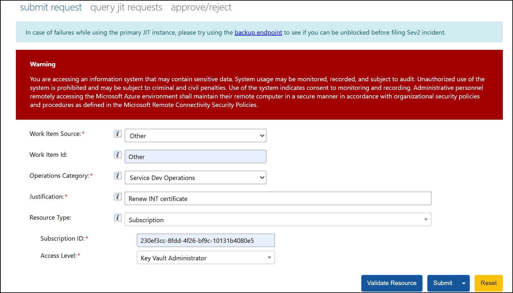
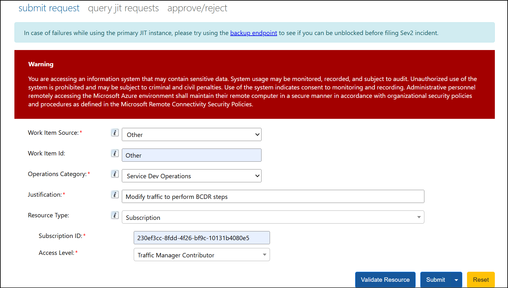

# How to JIT into Azure Key Vault and Azure Traffic Manager

## Target Audience
Payment Experience Service

#### JIT Portal: [Public - JIT Access Portal](https://jitaccess.security.core.windows.net/WorkFlowTempAccess.aspx)

## Prerequisite:
1. **A SAW** is needed for getting JIT access. Please follow these instruction to acquire, set up your SAW:  [SAW User Onboarding](https://microsoft.sharepoint.com/sites/CentralizedSAWProgramTeam/SitePages/SAW-User-Onboarding.aspx)
2. **Join Silo group** by following these instructions: [C+AI / Azure User Onboarding](https://microsoft.sharepoint.com/sites/CentralizedSAWProgramTeam/SitePages/C+AI---User-Onboarding.aspx)
3. **Request a PME account** by following these instructions: 
	*	Navigate here, [https://oneidentity.core.windows.net](https://oneidentity.core.windows.net)
	*	Under User Accounts, click 'Create/Manage User Account'.
	*	Select **pme** as Domain, enter your alias, and fill out the form as shown in this video: [Create User Account (NEW).webm](https://microsoft.sharepoint.com/:v:/t/CDOCIDM/ER-PUWEJvcJEjJ7Nj2zOBPkBQirG2IfHokrm72hMELBmHg?e=zkF2gq)
	*	**Note:** A PME account request can be created on your behalf by your peer or manager.
4.  **Request a YubiKey** by filling out this form: [Security Key Request](https://cloudmfa.support.windows.net/SecurityKeyServices/SecurityKey)
	*	Use following link to enroll certificate for YubiKey:  [Azure Security Key Guide](https://microsoft.sharepoint.com/teams/CDOCIDM/SitePages/SecurityKeySetupGuide.aspx)
	*	Alternatively, use this video for reference: [AccountManagement-OneYubi.mp4](https://microsofteur.sharepoint.com/:v:/t/SovereignFoundations/EbyFFVD9kMJFom9fZN9AxSMBK-0wZgSkRTNFXvDzKdLN7g?e=Ur429c&nav=eyJyZWZlcnJhbEluZm8iOnsicmVmZXJyYWxBcHAiOiJTdHJlYW1XZWJBcHAiLCJyZWZlcnJhbFZpZXciOiJTaGFyZURpYWxvZy1MaW5rIiwicmVmZXJyYWxBcHBQbGF0Zm9ybSI6IldlYiIsInJlZmVycmFsTW9kZSI6InZpZXcifX0%3D)
5. **Join the PME domain security group** to get read access to all subscriptions and to request JIT access for a subscription by following the instructions below::
	*	Navigate here, [https://oneidentity.core.windows.net](https://oneidentity.core.windows.net)
	*	Under Security Groups, click 'Create/Manage Security Group'.
	*	Select **pme** as Domain and enter **UST-PST-DevJITAccess** as Group Name -> Click Next.
	*	Scroll down till Members section -> Add your alias in the text box and click 'Add Members'. 
	*	Click 'Submit Changes' -> In the new Pop-up, Provide 'Business Justification' and click 'Ok'.
6. **Join IDWEB group**: PaymentsDev-JITAccess
7. **Complete the Cloud Screen Requirement**: (Complete ASAP as this process can take up to 14 days)  [https://screening.microsoft.com/](https://screening.microsoft.com/)

*	**JIT into Azure Key Vault**
	- To renew any necessary certificates, we typically need to JIT into Azure Key Vault using the Key Vault Administrator role. Below are the necessary details to raise the JIT request.
	
	  
		

*	**JIT into Azure Traffic Manager**
	- To perform BCDR steps and make traffic-related configuration changes on both INT and PROD subscriptions, we need to initiate a JIT request into Azure Traffic Manager (ATM). Below are the necessary details to raise the JIT request.

      
		
		
