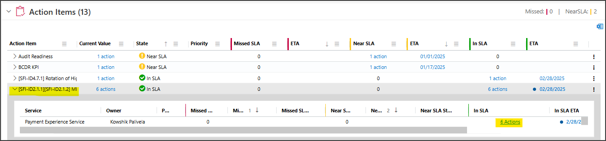
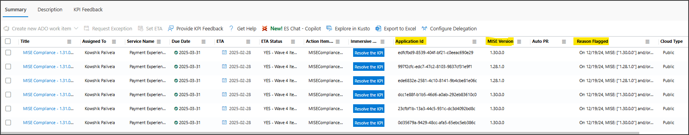

## KPI Name
MISE Compliance

## Target audience
Any Service 

## Overview
**What is MISE?** 
The Microsoft.Identity.ServiceEssentials packages. These packages are used to validate auth requests across Microsoft services. The MISE Compliance KPI is a measure of how well a service is keeping up with the latest recommended version of MISE. The KPI is calculated by comparing the version of MISE that a service is using with the latest recommended version of MISE. If a service is not using the latest recommended version of MISE, it will be flagged as non-compliant.

All the services across Microsoft which validate auth requests will be flagged under MISE Compliance KPI in two scenarios:

1. If they are not using MISE for auth request validation.
2. If they are not on the latest recommended version of MISE.

#### To resolve this KPI, you need to follow below steps,
1. On S360 dashboard, expand MISE Compliance KPI and click on actions count to open the list of action items.

	
1. A new tab will open with details of flagged Application ID, Current MISE version, Reason flagged will show you the recommended package version.

	

    - Below are some known Application IDs and their respective names,
	    1. ede6832e-2581-4c10-8141-9b4cbe81e06c - Payment Experience Service INT
		1. 997f2cfc-edc7-47c2-8103-9837cf31e9f1 - Payment Experience Service
		1. edfcfbd9-8539-404f-bf21-c0eeac690e29 - PartnerSettingsService-INT-PME
		1. 0d35679a-9429-48cc-afa5-65ebc5eb386c - PartnerSettingsService-PROD-PME
		1. 23cfbf1b-13a3-44c5-931c-dc3d4092bd8c - SellerMarketPlaceProdApp
		1. dcc1e88f-b1b5-46d6-a0ab-292eb83610c0 - PayeeModernPlatformGenericAPI

1. By looking into the name of Application ID, you will easily identify it's respective repository. When you identifiy the repository, just <u>upgrade the MISE and MSAL packages</u> to the recommended version mentioned in the Reason flagged column.
1. To upgrade the MISE and MSAL packages, you need to follow the step 1 to step 12, step 15 and step 16 from following document. [Type: Upgrading NuGet packages](https://eng.ms/docs/office-of-coo/commerce-ecosystems/commerce-financial-systems/payment-and-settlement/payment-experience-service/documentation/operations/s360/cgtype-upgrading-nuget-packages)

**Note:** While upgrading MISE and MSAL packages, you need to follow specific sequence for respective repository,
- **PX**
	1. Microsoft.Identity.ServiceEssentials.Caching
	2. Microsoft.Identity.ServiceEssentials.Core
	3. Microsoft.Identity.ServiceEssentials.Telemetry.Abstractions
	4. Microsoft.Identity.ServiceEssentials.Telemetry.OneCollector
	5. Microsoft.Identity.ServiceEssentials.Authentication
	6. Microsoft.Identity.ServiceEssentials.Modules.TrV2Module
	7. Microsoft.Identity.ServiceEssentials.SDK
	8. Microsoft.Identity.ServiceEssentials.TokenAcquisition
	9. Microsoft.Identity.ServiceEssentials.TokenAcquisitionIdWeb
	10. Microsoft.IdentityModel.S2S.Configuration