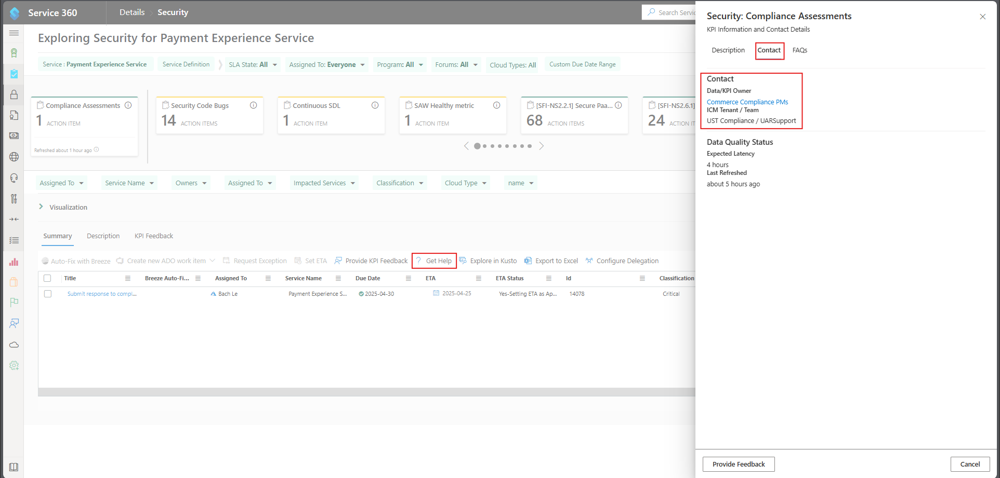

# S360

## Summary 
Documentation of all known s360 items to help relieve pain points and increase efficiency for future s360 work.  

## Service Tree
- Payment Experience Service: [e50abb8e-e976-4311-b12b-85156f4abc0e](https://microsoftservicetree.com/services/e50abb8e-e976-4311-b12b-85156f4abc0e)

### Repeated Tasks (_can occur either semiannually or annually_)
|Task Name| Steps to resolve|
|---|---|
|Accessibility							| Resolve all accessibility bugs listed.|
|Accessibility Testing					| Resolve all accessibility bugs listed and utilize any accessibility tools requested in the task.|
|Azure Efficiency						| Asks to make azure spending more efficient.|
|BCDR Drill								| Disaster Recovery Drill. [BCDR Document](https://microsoft.sharepoint.com/teams/PaymentExperience/Shared%20Documents/Forms/AllItems.aspx?id=%2Fteams%2FPaymentExperience%2FShared%20Documents%2FBCDR&viewid=dab0243d%2Dbefa%2D4c1c%2D939f%2D0e3531ab5ab3).|
|Security Code Bugs						| Resolve all component governance alerts listed. [Security Code Bugs TSG](CG-Security-Code-Bugs-OR-1ES-Open-Source-Vulnerabilities.md).|
|Certificate Auto-rotation				| Some certs that are not set to auto-rotate will be requested to get the work done to have them auto-rotate.|
|Expiring Certificates					| Certs nearing expiration will start to appear in S360 as early as 90 days so that we can go ahead to renew them.|
|Inaccurate Service Tree Metadata		| Update the Service Tree metadata according to the task.|
|Privacy Review							| [Steps to resolve](privacyReview.md)|
|SDL Current Values						| [Steps to resolve](sdl.md)|
|SAW Health Metric						| Every SAW must be booted up at least once every 30 days and have all updates installed. Contact the assigned team member to make sure their SAW is healthy.|
|Threat Model							| Create or update threat model and review it with security team when the model changes or every 6 months, whichever is shorter. [Threat Model Service Dashboard](https://threatmodelingportal.azurewebsites.net/).|
|Vulnerability Management				| Resolve the vulnerabilities listed in the task.|  

## Getting Help on KPIs (Key Performance Indicator)
If you need further clarification on an S360 action item after reviewing the documentation and KPI links, you can refer to the screenshot below to find the direct contact.
1. Click on the "? Get Help" button.
1. Click on the "Contact" tab in the blade that appears on the right.
1. Click on the Data/KPI Owner's name to email them.
