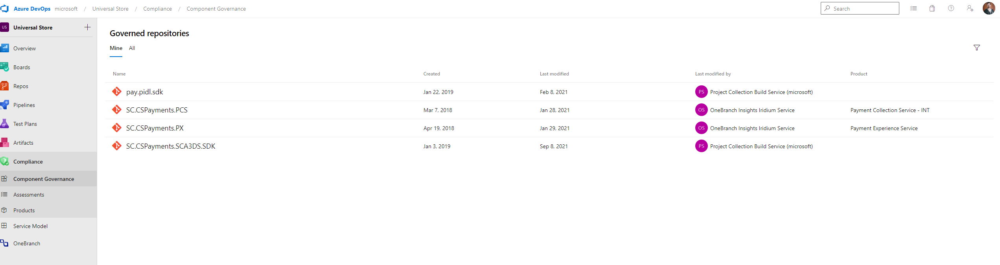
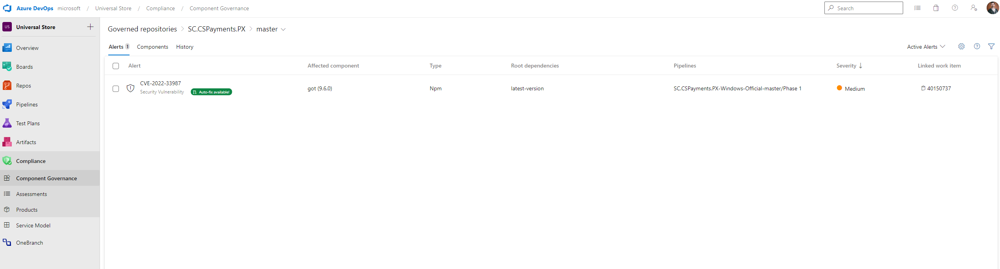
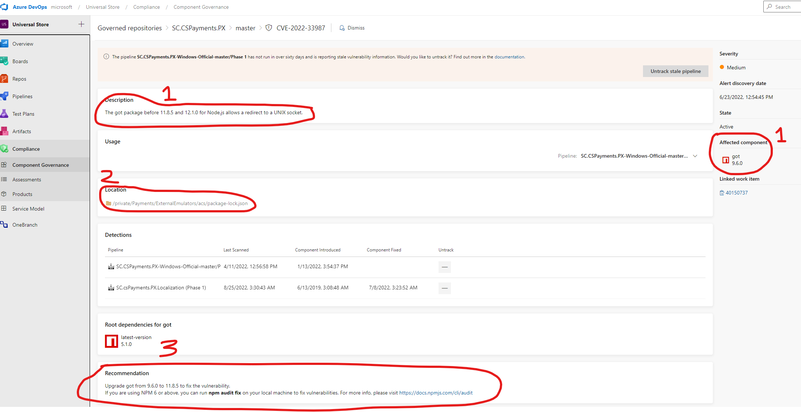

# Title
Component Governance

## Target audience
PX Engineering team

## Overview
Component Governance alerts occur when there is a reference in one of our repos to a library whose version has been found to have a security vulnerability.
In order to clear this alert, you must update that package to the suggested version in the alert.  
  
## Steps  
1. Follow the link either from s360 dashboard (not pictured) or the ADO sidebar (pictured below):

1. Choose the repository you want to check Component Governance compliance for (if coming from ADO dashboard)
1. Choose the alert to investigate

1. Read the alert notes. It will tell you the (1) affected package, (2) the locations of the package.json or nuget etc. that have a reference to this library, and (3) the version you must upgrade to.

1. Update the package in your package.json, Nuget Package Manager, etc. Make sure your project builds, runs, affected flows work end to end, etc.
1. Create a PR targeting master (or engineering for riskier changes) and have it reviewed.
1. Once the PR is merged to master and a successful build is completed on the deployment pipeline, the alert should go away in about a day or so.  
    

---
**IMPORTANT:**  
When you have updated the package and your PR has been merged to master, a production pipeline build that runs the scanning tools (one used for deployment should have them) will have to successfully run.  
Then, wait a day or so to see if the alert clears from s360 and Component Governance dashboard.  
Sometimes you may have to Dismiss the alert **AND** close the work item associated with that alert if it doesn't go away on its own after successful prod pipeline build and waiting for a day.

---
For questions/clarifications, email [author/s of this doc and PX support](mailto:mccordmatt@microsoft.com?cc=PXSupport@microsoft.com&subject=Docs%20-%20operations/s360/component-governance.md).

---