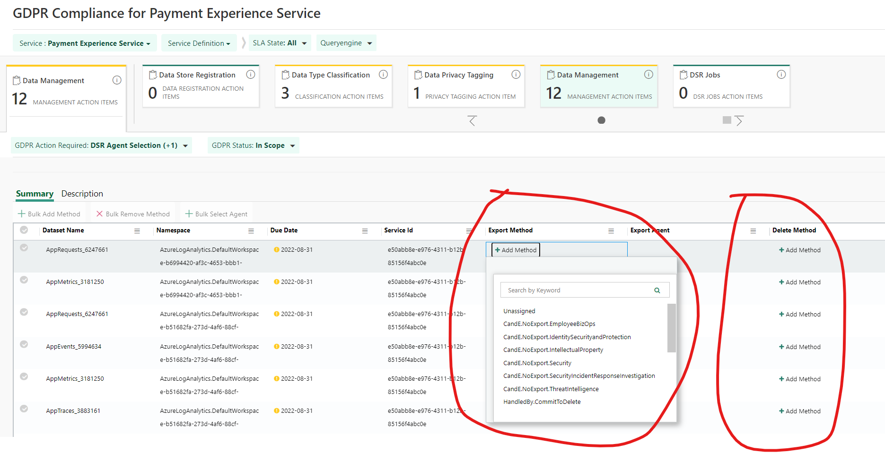

# Data Management

## Target audience
PX Engineering team

## Prerequisites
1. Access to [Data Studio](https://aka.ms/datastudio).  
_If you need access see **How do I get access to the data?** section in the [Data Studio FAQ](https://microsoft.sharepoint.com/teams/WAG/EngSys/DataStudio/DSWiki/FAQ.aspx)_
1. Access to set / update export and delete methods.  

## Note:
1. If you need more info on an asset for any of the following categories, you can open it in Data Studio by clicking the three dots at the end of the row and clicking "Open in Data Studio"

1. In [Data Studio](https://aka.ms/datastudio) you can also search for an asset by it's Name or **Dataset Name** column in s360.

### Data Management
Data Management involves adding a proper Export Method and Delete Method to an asset which is **In scope**.

1. To properly choose the Export / Delete Method you will need to know about the asset's **Data Retention Policy** in order to know how long data is retained for this asset.  
Please refer to the docs here: [Finding Data Retention for Azure Log Analytics](../../operations/data-retention.md) and [GDPR Guidance for Application Insights and Log Analytics](https://microsoft.sharepoint.com/:w:/r/teams/Application_Insights/_layouts/15/Doc.aspx?sourcedoc=%7BE2283A23-8CCB-478A-A3C4-0899BBD84CA1%7D&file=GDPR%20tagging%20and%20DSR%20configuration%20for%20AI%20and%20LA.docx&action=default&mobileredirect=true&cid=f9fe4aea-951b-4ece-a853-4e8ecb8d291d&wdLOR=c888A13EA-08D0-462E-863F-D109AE3EEFC9)
1. Refer to **Tagging Definitions** section in the [Data Management Tags](https://microsoft.sharepoint.com/teams/Azure_Compliance/GDPR/GDPR%20Wiki/Data%20Management%20Tags.aspx) docs to understand the meaning of each tag.
1. Assign the appropriate tag to each item.

---
For questions/clarifications, email [author/s of this doc and PX support](mailto:mccordmatt@microsoft.com?cc=PXSupport@microsoft.com&subject=Docs%20-%20operations/s360/data-management.md).

---