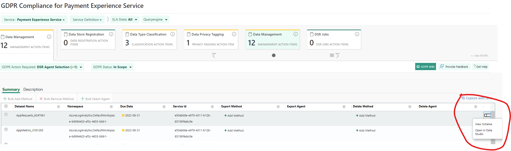
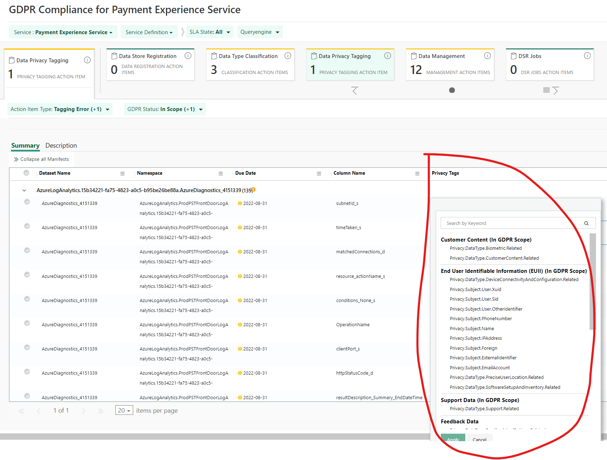
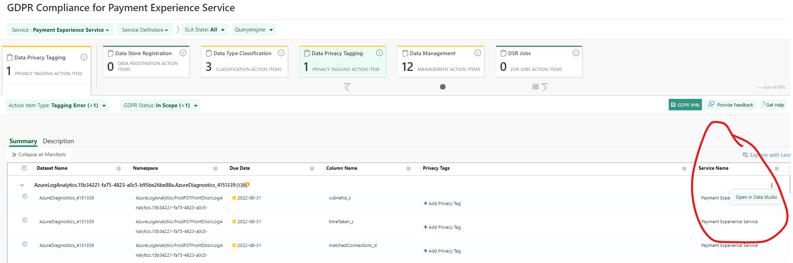
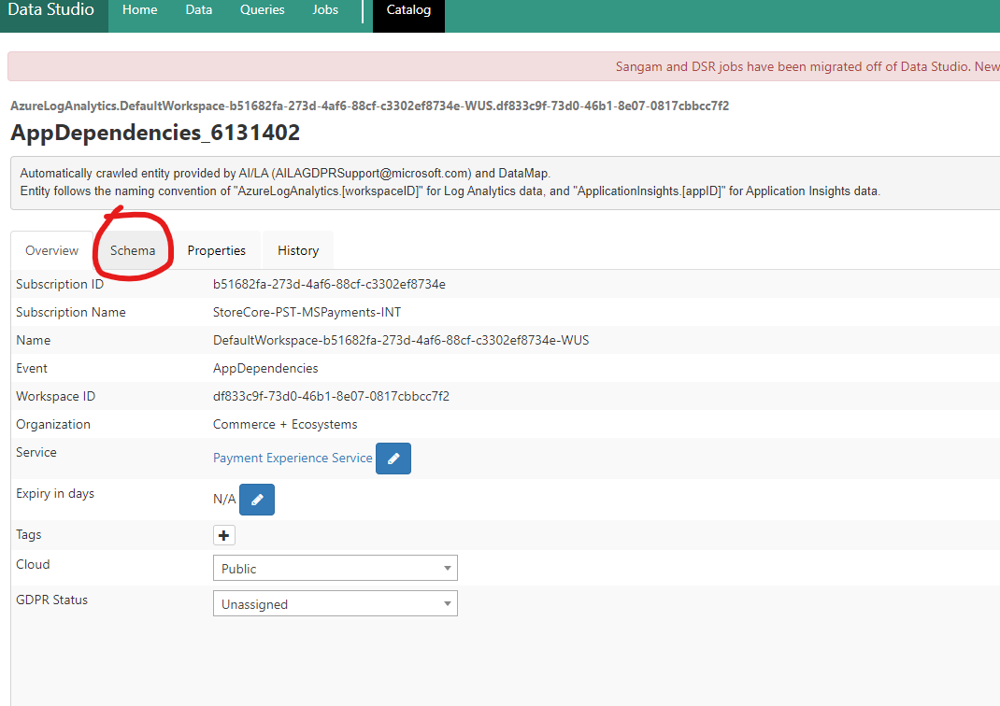

# Data Privacy Tagging

## Target audience
PX Engineering team

## Prerequisites
1. Access to [Data Studio](https://aka.ms/datastudio).  
_If you need access see **How do I get access to the data?** section in the [Data Studio FAQ](https://microsoft.sharepoint.com/teams/WAG/EngSys/DataStudio/DSWiki/FAQ.aspx)_
1. Access to set / update privacy tags.  

## Note:
1. If you need more info on an asset for any of the following categories, you can open it in Data Studio by clicking the three dots at the end of the row and clicking "Open in Data Studio"

1. In [Data Studio](https://aka.ms/datastudio) you can also search for an asset by it's Name or **Dataset Name** column in s360.

### Data Privacy Tagging
This category will have items that were tagged as in scope for GDPR but do not have Privacy Tags associated with the individual columns. If you tag an asset as in scope for **Data Type Classification**, it may eventually appear here for column tagging. If you tag it as out of scope, it should disappear from this section in s360. 
Data Privacy Tagging involves adding the appropriate Privacy Tags to an asset.  

>[!NOTE]
>If the asset has a yellow "?" next to it, hover the "?" to get some more info.  
>In the example screenshot it tells you that this asset is tagged as "Out of Scope" for GDPR, but has "Column level privacy tags".  
>This means that one of the columns is tagged with a personal info tag, which conflicts with being tagged "Out of Scope" for GDPR.  
>In this instance the tooltip will tell you that you need to either remove the column level tag or mark the asset as GDPR "In Scope" and make sure all appropriate tags are applied to columns with personal info.  
1. Open asset in Data Studio by clicking the 3 dots to the far right of the top column and selecting "Open in Data Studio"  

1. In Data Studio, click on the **Schema** tab:

1. Refer to the column **Name** to know the name of the data you are tagging. This will tell you what it could be. Personal data is any information relating to an identified or identifiable person. Choose the tag that most closely fits. **E.g.** Column with name `CallerIpAddress` will most likely want the tag `Privacy.Subject.IPAddress`
1. Refer to [Privacy Tags Taxonomy](https://microsoft.sharepoint.com/sites/privacy/SitePages/NGP-PrivacyTagsTaxonomy-Privacy%20Subject.aspx?originalPath=aHR0cHM6Ly9taWNyb3NvZnQuc2hhcmVwb2ludC5jb20vOnU6L3MvcHJpdmFjeS9FYTV5Tmh1T01ubE1tSHhUY2hHQWpsc0IxeDVFNVJEVG9pN1diczItd29hbFJ3P3J0aW1lPXFxcDR0aEpEMlVn#user-anid) and [GDPR wiki](https://microsoft.sharepoint.com/teams/Azure_Compliance/GDPR/GDPR%20Wiki/Geneva.aspx) in order to understand what each tag means so you can appropriately tag each asset listed.

---
For questions/clarifications, email [author/s of this doc and PX support](mailto:mccordmatt@microsoft.com?cc=PXSupport@microsoft.com&subject=Docs%20-%20operations/s360/data-privacy-tagging.md).

---