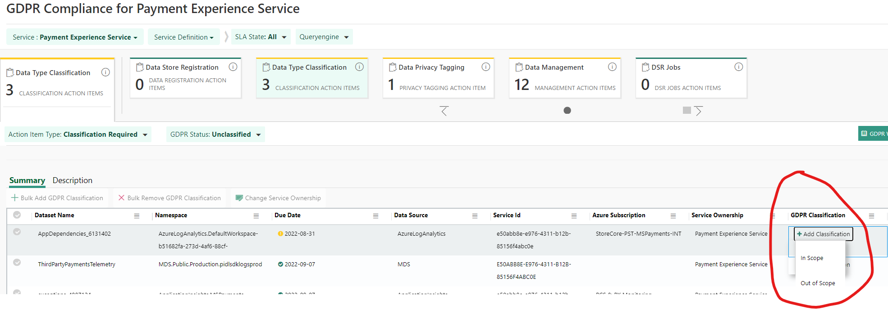
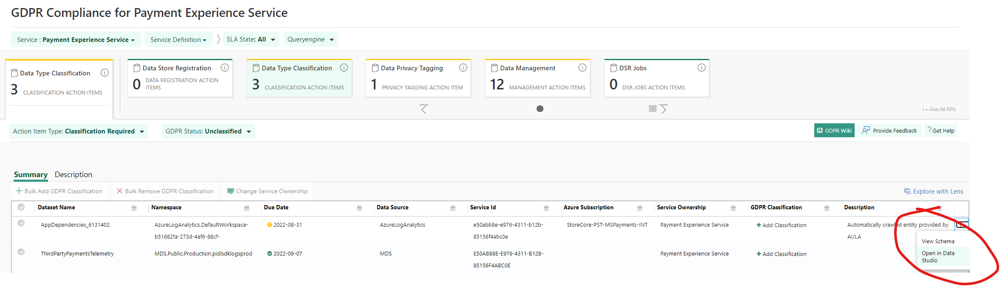

# Data Type Classification

## Target audience
PX Engineering team

## Prerequisites
1. Access to [Data Studio](https://aka.ms/datastudio).  
_If you need access see **How do I get access to the data?** section in the [Data Studio FAQ](https://microsoft.sharepoint.com/teams/WAG/EngSys/DataStudio/DSWiki/FAQ.aspx)_
1. Access to set / update classifications.  

## Note:
1. If you need more info on an asset for any of the following categories, you can open it in Data Studio by clicking the three dots at the end of the row and clicking "Open in Data Studio"

1. In [Data Studio](https://aka.ms/datastudio) you can also search for an asset by it's Name or **Dataset Name** column in s360.

### Data Type Classification
Data Type Classification involves tagging an asset as **In Scope** or **Out of Scope** for [GDPR](https://aka.ms/GDPR). Data type classification and Data privacy tagging can be done together in Data Studio.

1. In order to understand if this asset contains personal data or not, you will want to open the asset in Data Studio. You can do so by clicking the three dots at the end of the row for the s360 KPI:

1. In Data Studio, click on the **Schema** tab:

1. Look at each field and see if any of them qualify as personal data. If so, add a Privacy tag by clicking the "+" under **Privacy tags** column.  
Any data that could be used to identify an individual account or person associated with that account is considered personal data. **E.g.:** User account ID is personal data. Organization ID is not personal data.
More details on adding tags can be found under Data Privacy Tagging section.
1. Click the **Overview** tab and select the **GDPR status** of assets with personal data as **In scope** else as **Out of Scope**. The datasets which are chosen as ‘In scope’ will be moved to Data Privacy Tagging.

---
For questions/clarifications, email [author/s of this doc and PX support](mailto:mccordmatt@microsoft.com?cc=PXSupport@microsoft.com&subject=Docs%20-%20operations/s360/data-type-classification.md).

---