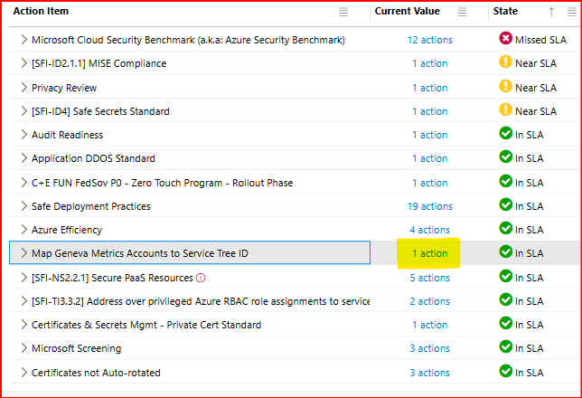
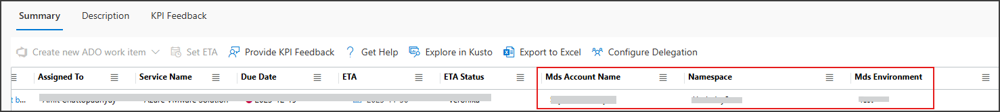
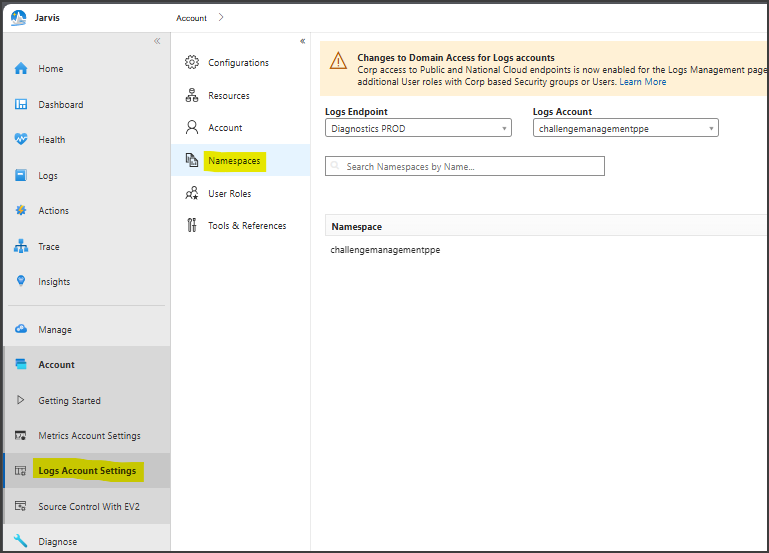
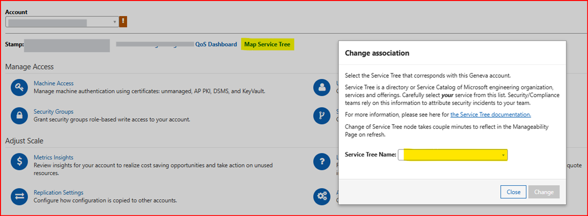
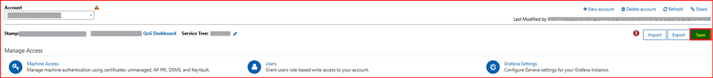

## KPI Name
Map Geneva Metrics Accounts to Service Tree ID

## Target audience
Any Service 

## Overview
The KPI requirement is to have service tree mapped in the Geneva Metrics Account. 

#### To resolve this KPI, you need to follow below steps,
1.	On S360 dashboard, click on ‘Actions’.

    
2.	On newly opened page, Look for and note down the Mds Account Name, Namespace, and Mds Environment.

    
3.	Open new tab in browser and navigate to [Logs Account Settings](https://portal.microsoftgeneva.com/account/logs) -> Namespaces. In this page, select Logs Endpoint as per the Mds Environment, select Logs Account as per the Mds Account Name, and select Namespace as per the Namespace noted in step 2. Hit "Enter" to Search.
 
    
 1. Click on “Map Service Tree”, a popup will open -> select service tree name accordingly. Here, in this case, Payment Experience Service. Click on “Change” button to Map the Service Tree.

    
5.	Click on “Save” button to save the changes.
 
    