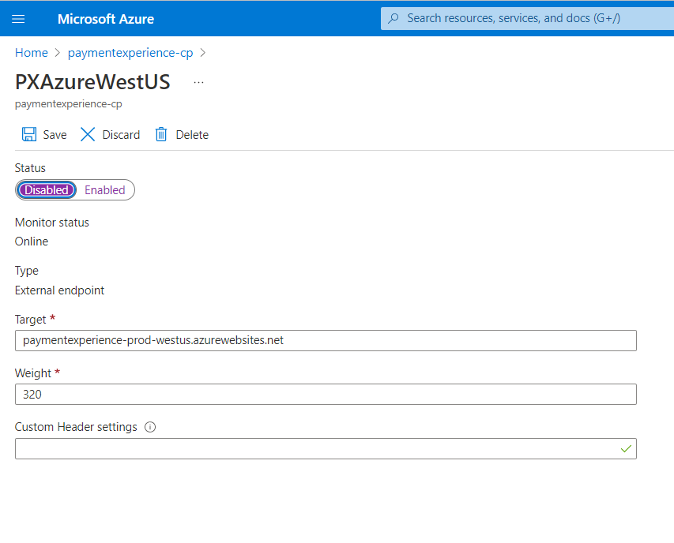

# Take a Region Offline

## Target Audience
PX Engineering team

## Prerequisite 
[PME account is required](./livesite-sop.md) 

## Apply JIT for Azure Traffic Manager
After following the steps to apply, the JIT access should be automatically approved. If you don't have PME account, please [engage the SRE to take region offline](./livesite-sop.md)

 - Work Item Source: ICM (required)
 - Work Item Id: The ICM ID
 - Resource Type: Subscription
 - Subscription Id: 9b6168fd-7d68-47e1-9c71-e51828aa62c0
 - Access Level: Traffic Manager Contributor
 
 

## Disable a Region
- Use PME account to login [PX ATM](https://portal.azure.com/#@mspmecloud.onmicrosoft.com/resource/subscriptions/9b6168fd-7d68-47e1-9c71-e51828aa62c0/resourceGroups/PX-Services-PROD-TM/providers/Microsoft.Network/trafficmanagerprofiles/paymentexperience-cp/overview)
- Pick the region having issue
- Update "Status" with "Disable"
- Click "Save" button

 

---
For questions/clarifications, email [author/s of this doc and PX support](mailto:PXSupport@microsoft.com&subject=Docs%20-%20operations/feature-flighting.md).

---