# New partner Onboarding to standard PIDL templates

## Overview

This document focuses on the general information required for a new partner to onboard on to payment platform using the PIDL (**P**ayment **I**nstrument **D**escriptor **L**anguage) SDK.

*Note: This document is created with the assumption that the requirement and design conversations have already been completed, and the partner team is ready to start the onboarding process.*

## Payments team contacts

----------------------------------------------------------------------------------
  Payment Experience Support <pxsupport@microsoft.com> - For any support related questions

  Payment Experience Oncall <pxoncall@microsoft.com>   - For any production traffic related questions  

## Quick overview of onboarding process & Payment\'s platform interaction:

Below is a very high-level architecture which will help in understanding the onboarding process pre-requisite steps followed by interactions between payment layers when a request comes in to render a payment form on partner portals. This is a bird's eye view and does not list all the API interactions for each component. Those will be covered in the Step 3 section of this document.

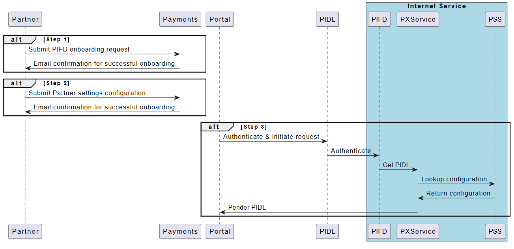

## Onboarding steps to Payment platform using the PIDLSDK

### Step 1: Payment Instrument Front Door (PIFD) onboarding

The first step of onboarding is to add the partner's ClientID or AppID (Application identifier) to the allowed list, so that the client can be authenticated to successfully render PIDL components on their portal.

The partner can start by submitting a request via [PIFD onboarding request form](https://forms.office.com/r/0LV5UvWwtM). Before you start filling out the request you should have the following details available,

1.  Your team details like team name, team POC, Service tree Id, IcM team name etc.
2.  Scenario specific details like PIDL components, Payment instruments to be supported etc.
3.  Auth Token details like AAD (User, app), MSA, compact tokens, certificates etc.
4.  Which environment needs to be supported (INT, PPE, PROD).

For additional details on how to complete the form and more details regarding different authentication types, please refer to "*Partner Onboarding Doc*" in Appendix section.

### Step 2: Partner Settings Service (PSS) onboarding

Partner setting service stores partner specific PIDL configurations. These configurations/settings will include partners choice of

1.  Various PIDL components like List PI, Select PM, Address, Credit card etc.

2.  Markets (US, CA, EU etc.)

3.  Template type like Default, Split form for Credit Card etc.

4.  Features

    a.  Out of the box features

        i.  Zip +4 (Consumer flow), Trade AVS (Commercial flow),

        ii. Single Market Directive for EU markets,

        iii. PSD2 for EU market,

        iv. 3DS for India market

    b.  Customizable features

        i.  Pre-requisite for profile.

        ii. Additional header text.

        iii. Additional footer text.

        iv. Custom button labels

Partners can submit their configuration choices by filling out [Onboarding Partner settings](https://forms.office.com/r/YvVzPJKXV1) form.

*[Note: Partner can always submit additional requests on top of the original request for updates.]{.mark}*

### Step 3: Payment Instrument Descriptor Language (PIDL) components & integration

The partner portals can integrate with one or more PIDL components based on their specific scenario. With the new standard templates, the partners can choose from a set of templates which best suits their specific need.

By onboarding these standard templates, the partner can get the following benefits.

1.  Compliance --- All the market-based compliance requirements will be handled out of the box.

2.  Error-handling --- Client-side data collected via PIDL forms will be validated with appropriate error messages.

3.  Accessibility --- Accessibility requirements for the form w.r.t tab order, narrator, Luminosity etc. will be handled.

4.  Localization --- All PIDL forms will be localized.

##### Technical details:

-   The new standard PIDL forms are built in React and use FluentUI element factory.

-   PIDL SDK version: 1.22.10 or higher

-   Download link: Universal.Store.NPM - Azure Artifacts (visualstudio.com)

##### Project Timeline

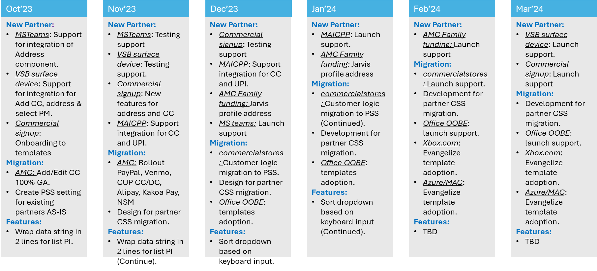

##### List Payment Instrument:

**Scenario: New User**

Betty would like to purchase a M365 personal subscription and clicks on "Buy Now" button. She has logged in with her newly created MSA account <betty@hotmail.com>. Since it\'s her first time purchasing a Microsoft product using this MSA, she will be presented with an option to "Add a payment method" during her checkout process.

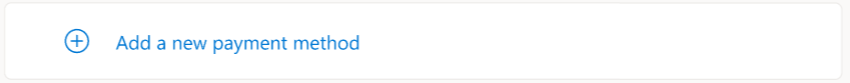

**Scenario: Returning User**

Sam is an existing Microsoft user who has an MSA <sam@outlook.com> which he uses to purchase various Microsoft products from the Microsoft store. He has multiple payment instruments associated to his MSA. When Sam clicks on "Buy Now" Button for purchasing M365 subscription using his MSA, he will be presented with the list of all his payment instruments associated with the MSA in use for him to choose from.

**Templates:**

There are 3 different templates that the partner can choose from based on their need

-   Dropdown List view

> 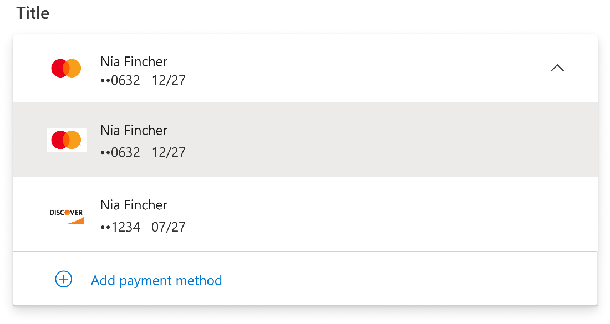

-   Button List view

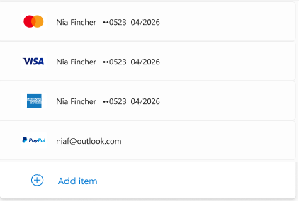

-   Radio button view

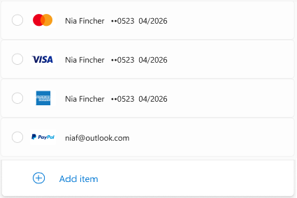

**Call sequence:**

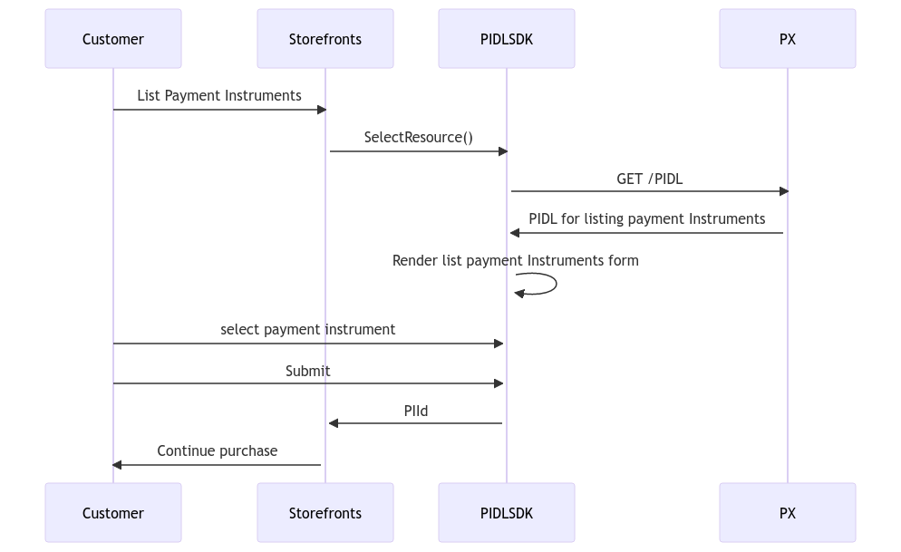

**API reference:**

*PIDLSDK API contract for list PI form can be found in*
[*Pidlsdk#selectResource*](https://www.osgwiki.com/wiki/Pidlsdk#selectResource)

***Component behavior with and without* *PI saved in user's account*:**

Without any PIs in the account, only \"Add a new payment method\" button will be rendered by SelectResource component. By clicking the button, the client will receive a signal from PIDLSDK to render select PM form to choose a payment method to add.

If there is any PI saved in the user\'s account. Both "Add a new payment method" button and the form of PI list will be rendered by SelectResource component.

##### Select Payment method

**Scenario:**

As a customer, Betty would like to know which different payment methods she can use to pay for the new office subscription she is interested in purchasing.

**Template:**

The Payment method list is dynamically generated based on the country selected. The payment methods are filtered based on the country for which it is requested, if the payment method is supported for the product that is being purchased (This is a product catalogue configuration) and if the portal wishes to support the payment type.

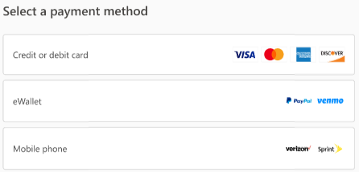

This is the new "Grouped" payment method template. By grouping the payment methods together by the payment type the customer gets to know all available options in a single consolidated format. After making a choice of which payment type the user wants to continue with (for e.g. "eWallet"), if there are multiple choices (like "PayPal and "Venmo") the user will be presented with a second screen where they can pick the payment instrument, which they to add and continue with the flow to add the PI.

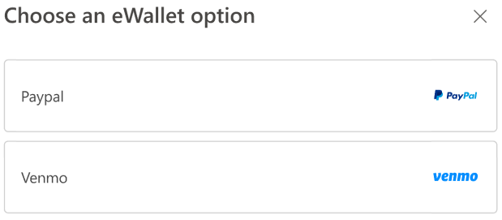

**Call sequence:**

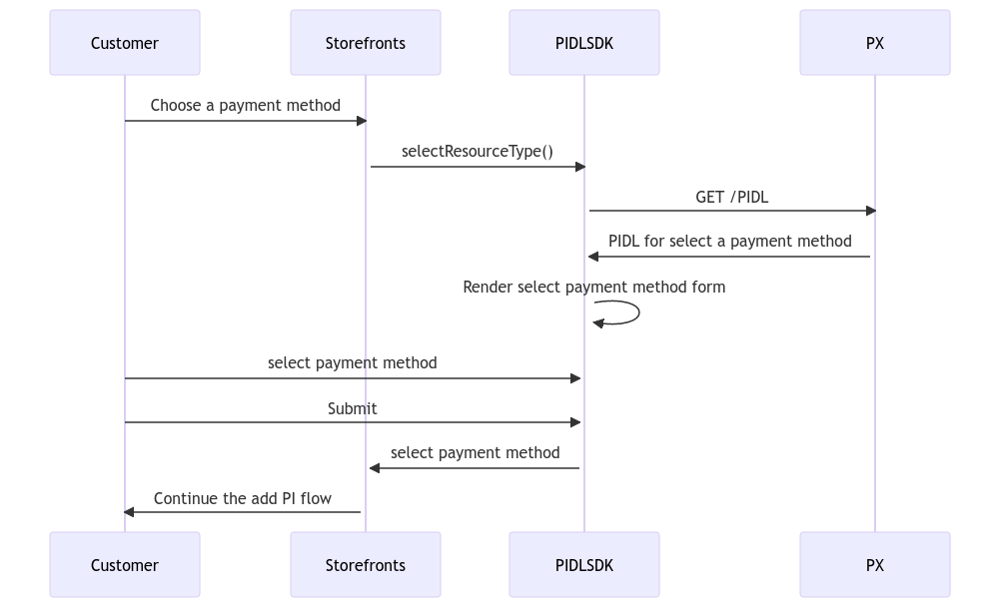

**API reference:**

*PIDLSDK API contract for select payment method form can be found in*
[*Pidlsdk#selectResourceType*](https://www.osgwiki.com/wiki/Pidlsdk#selectResourceType)

##### Add a payment method

**Scenario: Add a credit or debit card**

Betty would like to make a payment using a credit card.

Globally supported credit cards: Visa, Mastercard, Amex, Discover.

Other credit cards supported based on country: JCB (Japan), Hiper, Elo
(Brazil), Verve (Nigeria)

**Template:**

**Default:** The default template for credit cards is a single page form
showing credit card details followed by billing address details in a
single view form with "Save" and "Cancel" buttons at the bottom of the
form.

The "Cancel" button will close the credit card form and take you to the
previous page.

The "Save" button will save the credit card and take you to "List" PI
with the newly added card as the selected option.

**Split form:**

Some experiences would not have enough real-estate to show the entire
credit card form and so we also provide a template with split version.
The first page will show the credit card details with a "Next" and
"Cancel" button. On click on "Next" button the billing address form will
be displayed with "Save" and "Cancel" button.

The "Cancel" button will close the credit card form and take you to the
previous page.

The "Save" button will save the credit card and take you to "List" PI
with the newly added card as the selected option.

**Call sequence:**

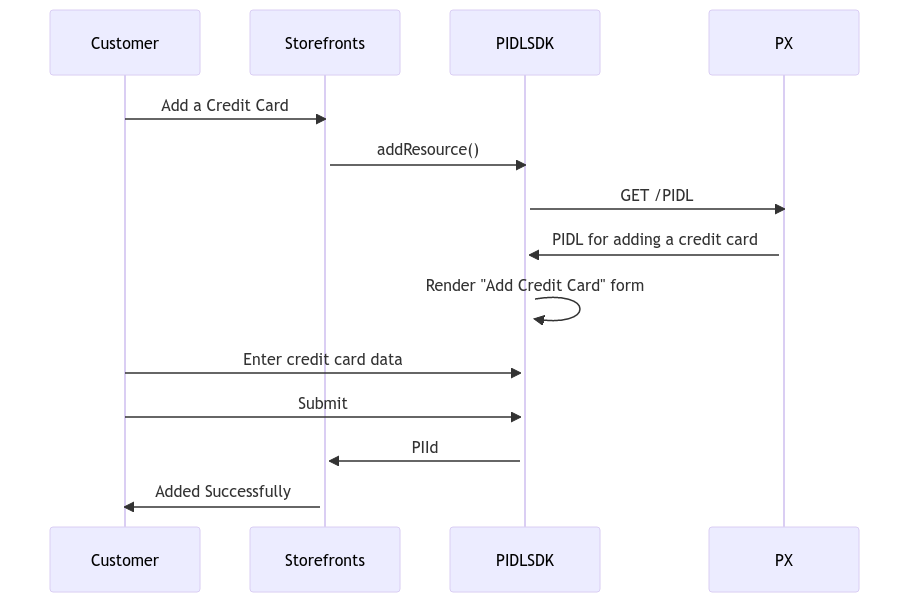

**API reference:**

*PIDLSDK API contract for Add PI form can be found in*
[*Pidlsdk#addResource*](https://www.osgwiki.com/wiki/Pidlsdk#addResource)

PIDL SDK buttons visibility is controlled by showSubmitBlock. For more
info see:

<https://www.osgwiki.com/wiki/Pidlsdk#DISPLAYOPTIONS>

##### Address Verification

**Scenario:**

As a portal we would like to validate the address entered by end user
for it to be correct and complete.

Commercial flow refers to this address validation as "Trade AVS (Address
Validation Service)" which is part of the trade screen process.

Consumer flows refer to this as "Zip+4" which is a compliance
requirement in US and CA to make sure the 4 digits of the ZIP code are
captured for the accuracy of the address.

The address validation service returns a few suggestions of the address
for the user to choose from.

**Template:**

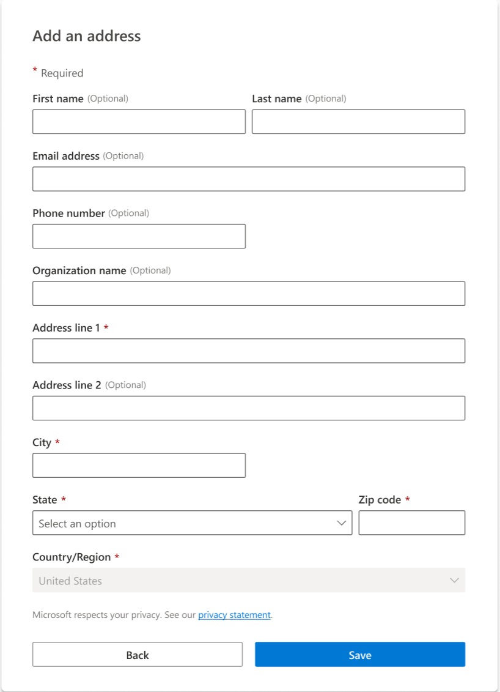

**Feature supported for above form:**

1.  Page title can be hidden if partner already has a title for the page
    or if address is embedded within other form.

2.  Custom localized string can be displayed based on the partner
    requirements. E.g.: "This address will be stored as sold-to address
    on your billing account".

*Note: Partner is responsible to pass the localized string when you make
a call to render this form.*

3.  Optional fields related to customer profile \[First name, Last name,
    Email address, Phone number and Organization name\] on this form can
    be selected based on the requirement to be displayed or hidden.

4.  Optional fields related to the postal address \[Address line 2,
    Address line 3, or other fields which are optional based on country
    requirements\] cannot be hidden and will always be presented to the
    end user.

5.  By default, "First name" and "Last name" will be on the same line,
    but we can configure it to be on separate lines.

6.  By default, "State" and "Zip code" are on separate lines, but we can
    configure it to be on the same line.

7.  "Country/Region" dropdown will be editable for commercial partners
    and disabled for consumer partners.

8.  The default buttons on the page can be hidden from the page if the
    partner wishes to use their own custom buttons.

9.  Please find more details about the address form in [Standard Address
    Form
    Features.docx](https://microsoft.sharepoint.com/:w:/t/PaymentExperience/EYxr__w22GtKh6xcOk9HGjkBqSdbIX4HtiNj8Ip7hZ47ng?e=eyFMwU).

##### Verify address

  ---------------------------------------------------------------------------------------------------
  Option 1                                                   Option 2
  ---------------------------------------------------------------------------------------------------
  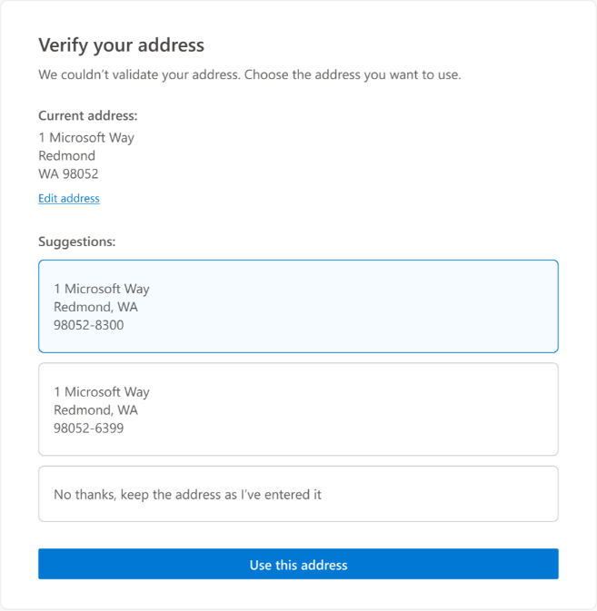                                  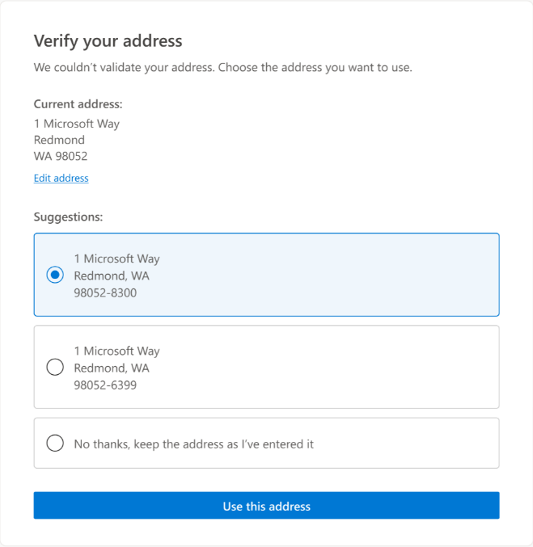
  ---------------------------------------------------------------------------------------------------

**Call sequence:**

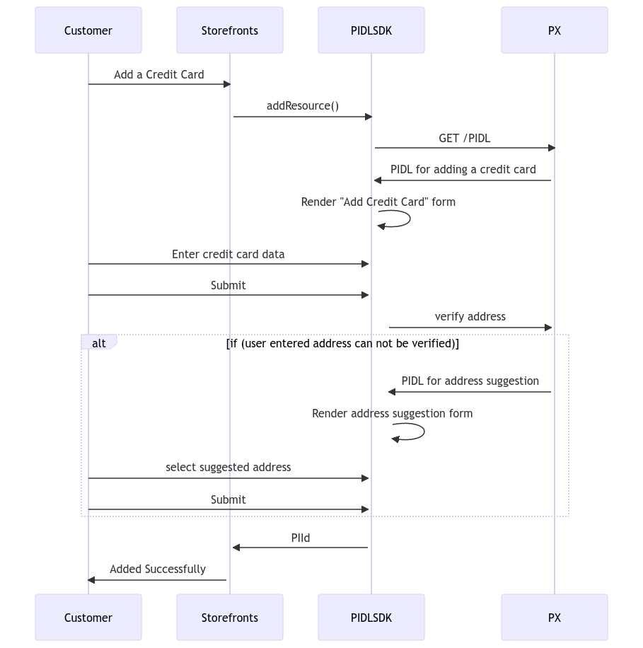

**API reference:**

*A more detailed API reference can be found
[here](https://microsoft.visualstudio.com/Universal%20Store/_git/SC.CSPayments.PX?path=/private/Payments/Docs/scenarios/trade-avs.md&_a=preview)
for the address validation feature of PIDLSDK.*

##### Handle challenge during purchase

**Scenario:**

As a portal selling hard goods and digital goods, the purchase must
comply with the different regulations imposed in different countries by
their legal authority.

E.g.: In EU the purchase has to comply with PSD2 regulations and
challenge the customer with 2FA to prevent fraud.

Similarly in India the customer has to presented with a 3DS challenge.

**Template:**

**Call sequence:**

**API reference:**

-   Payments SDK provides an API called "handlePaymentChallenge" which
    takes care of all the compliance requirements based on the
    respecting country in which the purchase has been initiated.
    \`\`This must be integrated as part of the purchase flow.

For contract level details please refer to
[handlePaymentChallenge](https://www.osgwiki.com/wiki/Pidlsdk#PSD2_challenge_operations)

-   In case of consumer flow sometimes the customer may have to provide
    a CVV as an additional risk challenge to prevent fraud. This can be
    handled by integrating with "handleRiskChallenge" API.

For contract level details please refer to
[handleRiskChallenge](https://www.osgwiki.com/wiki/Pidlsdk#ManageChallenge).

### Profiles
- Please find more details about the profile form in [Profile Form Features.docx](https://microsoft.sharepoint.com/:w:/t/PaymentExperience/EbpJFcKaERxFmjSN3VHQuOoBaAPQRQZ5c7Jl0Q8kaww2wQ?e=NeM1O9)

## Onboarding CHECKLIST

### Telemetry using 1ds

PIDLSDK uses 1DS for client-side telemetry, please find the instructions
for onboarding to 1ds through PIDLSDK.

<https://www.osgwiki.com/wiki/Pidlsdk#1DS>

To put portal domain in the CORS allowed list, navigate to https://aka.ms/GetMarTech and click the "New Request" button.
Select the option "General support for Adobe marketing tools, Analytics, 1DS Telemetry (replacing AskMarTech)" then click the "Next" button.
Select the option "1DS Telemetry and Tagging" then click the "Next" button.
Select the option "Modify Domain for existing App ID or iKey" then click the "Next" button.
In the text field provide the app id and list of domains needed. PidlSdk appId: **4127950a47f84a01a75e9a7d49d79f14-b56cc96f-0faa-4455-912a-6b8df93eeac5-6769.**, then click "Submit".

**Domain list example:**
microsoft-int.com
my-domain.com
partner-domain.com

### Pass green id to risk service

Green Id is passed from client to Risk service, which is used by Risk
service to facilitate risk analysis. Please find the instructions below
for passing green id to service. Green Id is optional, so the flow will
still complete, but is recommended for better Risk analysis.

<https://www.osgwiki.com/wiki/Pidlsdk#.5BOPTIONAL.5D_OPTIONS>

https://eng.ms/docs/cloud-ai-platform/commerce-ecosystems/commerce-engineering-operations/commerce-risk-engineering/modern-risk-service/modern-risk-service-onboarding-guide/api/green-id

### Jarvis FD Onboarding

For credit card completePrerequisites flow, PIDLSDK will create a
profile in Jarvis. The client application needs to be onboarded in
Jarvis.

[Customer Insights First Party - API onboarding questionnaires
(sharepoint.com)](https://nam06.safelinks.protection.outlook.com/?url=https%3A%2F%2Fmicrosoft.sharepoint.com%2Fteams%2FJarvisWiki%2FSitePages%2FAPI%2520onboarding%2520questionnaires.aspx&data=05%7C01%7Cwwei%40microsoft.com%7C84f9d7302e6a4ca8170108db3148136e%7C72f988bf86f141af91ab2d7cd011db47%7C1%7C0%7C638157957879501244%7CUnknown%7CTWFpbGZsb3d8eyJWIjoiMC4wLjAwMDAiLCJQIjoiV2luMzIiLCJBTiI6Ik1haWwiLCJXVCI6Mn0%3D%7C3000%7C%7C%7C&sdata=ZA2Dm4YqeH9BxfFWYvUyJNfIs3ox1peJrry%2BjF%2FjUF4%3D&reserved=0)

### For partners have a dependency on MAC (commercial partners) who need to create legacy payment instrument id

To create a credit card with legacy payment instrument ID, please pass
the flight header below into PIDLSDK:\
"x-ms-flight":"PersistLegacyRequired"

### PREREQUISITES FOR ADD PI for employee account

For employ account, PIFD requires an employee Jarvis account id to be
created before a PI can be added into the account. One workaround for
the client is to make a Get call to Jarvis end point
my/profiles?type=employee, which will create an employee Jarvis account
id automatically.

### PREREQUISITES FOR INDIA 3DS FOR NEW PARTNER ONBOARDING

- [India 3DS scenario](../scenarios/india-3ds.md)

## Integration checklist

### Testing in PPE

To test PIDLSDK in PPE environment, please set the "env" property of
PIDLSDK component (e.g. AddResource) as "ppe".

### Sample code for PIDLSDK integration

PIDLSDK is integrated into PIDLSDK React test portal, please find the
repo for the test portal below:

<https://microsoft.visualstudio.com/DefaultCollection/Universal%20Store/_git/pay.pidl.sdk?path=/tests/apps/pidl-react-portal>

[One example of AddResource
integration](https://microsoft.visualstudio.com/DefaultCollection/Universal%20Store/_git/pay.pidl.sdk?path=/tests/apps/pidl-react-portal/src/components/ResourceViewer.tsx&version=GBmaster&line=180&lineEnd=195&lineStartColumn=1&lineEndColumn=48&lineStyle=plain&_a=contents).

### Complete prerequisites

\"completePrerequisites\" is [one Boolean parameter for PIDLSDK add PI
component](https://www.osgwiki.com/wiki/Pidlsdk#AddPaymentInstrument).

In the commercial add PI flows, when \"completePrerequisites\" is set as
\"true\" and the user\'s Jarvis profile remains empty, PIDLSDK will
autonomously generate an employee profile in Jarvis, by using the data
entered in the credit card form, before adding the PI into PIMS. This
employee profile is essential for establishing a legacy billing account,
which is needed for adding the PI in the legacy payment system (CTP). As
many services / portals (e.g. MAC and OMS) are using the legacy payment
system, many commercial flows need to set completePrerequisites to be
true.

Partners need not set \"completePrerequisites\" to \"true\" under the
following conditions:

-   If the workflow is modern only.

-   If the partner has already generated a legacy billable account
    before invoking PIDLSDK. In such cases, the partner can simply pass
    the legacy billable account ID to the PIDLSDK parameter
    \"billableAccountId\" without the need to set
    \"completePrerequisites\" to \"true.\"

In the consumer add PI flows, when \"completePrerequisites\" is set as
\"true\" and the user\'s Jarvis profile remains empty, PIDLSDK will show
a standalone profile to create the user's profile, before showing the
add PI form.

### Prefill data

"prefillData" is one parameter that the partner could configure and pass
into PIDLSDK component to prefill fields with data in the PIDL form.
Typically, "prefillData" is a dictionary, in which the key is the
property name of a certain field in PIDL form (e.g. "address_line1"),
and the value is the display text that needs to be prefilled in the
field when PIDL form is loaded. An example is shown below:

var prefillData = { first_name: \"\<LE_firstname\>\", last_name:
\"\<LE_lastname\>\", address_line1: \"\<LE_addressline1\>\",
address_line2: \"\<LE_addressline2\>\", city: \"\<LE_city\>\", region:
\"\<LE_region\>\", postal_code: \"\<LE_postalCode\>\" };

pidlDDC.addResource(pidlDocInfo, prefillData, options);

Use [this
link](https://pidlsdktestportal.azurewebsites.net/PidlReact.html?init=%7B%22addressType%22%3A%22billing%22%2C%22anonymousPidl%22%3Atrue%2C%22elementFactoryName%22%3A%22fluentUi%22%2C%22environment%22%3A%22int%22%2C%22market%22%3A%22us%22%2C%22partner%22%3A%22vsbcart%22%2C%22rawPrefillData%22%3A%22%7B%20%5C%22address_line1%5C%22%3A%20%5C%22One%20Microsoft%20Way%5C%22%2C%20%5C%22address_line2%5C%22%3A%20%5C%22%5C%22%2C%20%5C%22city%5C%22%3A%20%5C%22Redmond%5C%22%2C%20%5C%22region%5C%22%3A%20%5C%22WA%5C%22%2C%20%5C%22postal_code%5C%22%3A%20%5C%2298052%5C%22%2C%20%5C%22email%5C%22%3A%20%5C%22test%40test.com%5C%22%2C%20%5C%22phoneNumber%5C%22%3A%20%5C%221234567890%5C%22%2C%20%5C%22language%5C%22%3A%20%5C%22en%5C%22%2C%20%5C%22company_name%5C%22%3A%20%5C%22test%5C%22%2C%20%5C%22culture%5C%22%3A%20%5C%22en-us%5C%22%2C%20%5C%22cvvToken%5C%22%3A%20%5C%22%5C%22%2C%5C%22accountToken%5C%22%3A%20%5C%22%5C%22%2C%20%5C%22expiryMonth%5C%22%3A%20%5C%221%5C%22%2C%20%5C%22expiryYear%5C%22%3A%20%5C%222024%5C%22%2C%20%5C%22accountHolderName%5C%22%3A%20%5C%22test%20test%5C%22%2C%20%5C%22first_name%5C%22%3A%20%5C%22test%5C%22%2C%20%5C%22last_name%5C%22%3A%20%5C%22test%5C%22%7D%22%2C%22resourceType%22%3A%22Address%22%2C%22windowSize%22%3A%22amcDialog%22%7D)
to try prefillData in PIDL test portal:

For more details, please see
<https://www.osgwiki.com/wiki/Pidlsdk#Add.2FEdit_Billing_Address>

### Use showSubmitBlock TO hide/show submit buttons

PIDL SDK buttons visibility is controlled by showSubmitBlock. For more
info see:

<https://www.osgwiki.com/wiki/Pidlsdk#DISPLAYOPTIONS>

If showSubmitBlock = false in the display options is passed in, then you
can interact with the submit button programmatically by calling
moveNextPage() like this:\
pidlDocInstance.moveNextPage();

In react calling moveNextPage() like this:

private onMoveNextPageClick = () =\> {

this.state.ref?.current.moveNextPage();

}

### ADD additional title or description under the title

For credit card form and address form, if partner would like to add
additional description under the title as shown below:

You could pass localized string through prefillData of PIDLSDK, an
example is shown below:

{\"additionalHeader\": \"Your localized string for additional header\",
\"additionalFooter\":\" Your localized string for additional footer\"}

A prerequisite to use this feature above is to add the below two
features into the setting of the partner in PSS:

\"features\": {

\"enableAddtionalHeader\": {

\"applicableMarkets\": \[\],

\"displayCustomizationDetail\": \[

{

\"usePSSForPXFeatureFlighting\": true

}

\]

},

\"enableAddtionalFooter\": {

\"applicableMarkets\": \[\],

\"displayCustomizationDetail\": \[

{

\"usePSSForPXFeatureFlighting\": true

}

\]

}

}

### PIDLSDK error codes

Error codes from PIDLSDK are listed here errorMessages.ts - Repos
(visualstudio.com)

### Example of ru and rx urls

[http://www.microsoft.com/en-IN/store/rds/v2/GeneralAddPISuccess](https://nam06.safelinks.protection.outlook.com/?url=http%3A%2F%2Fwww.microsoft.com%2Fen-IN%2Fstore%2Frds%2Fv2%2FGeneralAddPISuccess&data=04%7C01%7Cwwei%40microsoft.com%7C6be1afdbe71b4345d9ad08d9b8eb1eb9%7C72f988bf86f141af91ab2d7cd011db47%7C1%7C0%7C637744142234870942%7CUnknown%7CTWFpbGZsb3d8eyJWIjoiMC4wLjAwMDAiLCJQIjoiV2luMzIiLCJBTiI6Ik1haWwiLCJXVCI6Mn0%3D%7C3000&sdata=w40y%2FW3nP9zjv5VJSUqDCLsxLDxLkN7WVeVojX1NT3E%3D&reserved=0)

<http://www.microsoft.com/en-IN/store/rds/v2/GeneralAddPIFailure>

[https://www.microsoft.com/en-in/store/rds/PurchaseRiskChallengeRedirectSuccess\
](https://www.microsoft.com/en-in/store/rds/PurchaseRiskChallengeRedirectSuccess)<https://www.microsoft.com/en-in/store/rds/PurchaseRiskChallengeRedirectFailure>

### Sample code to use callbacksIn TO GET submit PAYLOAD IN SUBMIT HANDler

const onSubmitHandler: submitCallback = React.useCallback(

(request: ISubmitRequest) =\> {

var data = request.data;

const postBillingAccountIWRequestBody: IPostBillingAccountIWRequest = {

legalEntity: {

firstName: data.address.firstName,

middleName: \'\',

lastName: data.address.lastName,

email: email \|\| \'\',

companyName: companyName \|\| \'\',

address: {

addressLine1: data.address.addressLine1,

addressLine2: \'\',

addressLine3: \'\',

city: data.address.city,

state: data.address.region,

postalCode: data.address.postalCode,

countryCode: data.address.country,

},

},

cultureInfo: {

culture: locale ?? PIDL_CHALLENGE_DEFAULT_LOCALE,

language: language \|\| \'en\',

},

paymentInstrument: {

paymentInstrumentType: \'None\',

},

agreementTemplateId: \'9303e132-70b2-4a01-9b9b-605511b6283a\',

riskBag: {

deviceType: \'Browser\',

greenId: cartId,

clientId: \'TeamsMarketplace\',

},

};

dispatch(postBillingAccountIW({ postBillingAccountIWRequest:
postBillingAccountIWRequestBody }));

},

\[cartId, companyName, dispatch, email, language, locale\]

);

const callbacksIn: ICallbacks = {

submit: onSubmitHandler,

};

return (

\

\<AddResource

pidlDocInfo={pidlDocInfo}

elementFactory={fluentUIElementFactory}

userContext={userContext}

returnOptions={returnOptions}

displayOptions={displayOptions}

callbacksIn={callbacksIn}

env={PIDL_CHALLENGE_ENV_PROD}

/\>

\</div\>

);

## How to upgrade to latest version of PIDLSDK
### NPM feed for PIDLSDK can be found in this link https://www.osgwiki.com/wiki/Pidlsdk#Getting_access_to_SDK_npm_package
1. for partner using JS version of PIDLSDK, upgrade the below scope to the latest version of PIDLSDK in package.json file, for example:
    - "@cspayments/pidlsdk": "2.5.0"
2. for partner using React version of PIDLSDK, upgrade the below scopes to the latest version of PIDLSDK in package.json file, for example if fluent UI element factory is used:
    - "@cspayments/pidl-fluent-ui": "2.5.0",
    - "@cspayments/pidl-react": "2.5.0"

## How to migrate to standard template flow for exisitng PIDLSDK partners
1. There are no contract changes for both JS and React version of PIDLSDK.
2. Upgrade to the latest version of PIDLSDK. The minimum version supports standard template flow is 2.5.0.
3. Integrate with standard template by sending an addtional request header (x-ms-flight), which will be provided by PIDL team.
    - For partner using JS version of PIDLSDK
        - If partner could migrate to fluent UI element factory of PIDLSDK React
            - The stylings will come out of box for standard PIDL templates in fluent UI element factory of PIDLSDK React.
        - If partner still uses JS version of PIDLSDK
            - Partner may need to make minor CSS changes for the standard PIDL templates.

    - Partner using PIDLSDK React classic element factory
        - If partner could migrate to fluent UI element factory of PIDLSDK React
            - The stylings will come out of box for standard PIDL templates in fluent UI element factory of PIDLSDK React.
        - If partner still uses classic element factory
            - Partner may need to make minor CSS changes for the standard PIDL templates.

    - For partner using PIDLSDK React fluent UI element factory
        - The stylings will come out of box for standard PIDL templates in fluent UI element factory of PIDLSDK React.

### FAQ
#### Why dropdown doesn't show the list of items when it is clicked?
- Some existing partners who use JS version of PIDLSDK were onboarded by using a different type of dropdown. Please contact PIDL team to enable a feature in the partner setting to use the other type of dropdown to fix this issue.

## Redirect service 

## Appendix:

[Partner Onboarding Doc.docx
(sharepoint.com)](https://microsoft.sharepoint.com/:w:/r/teams/pims/_layouts/15/Doc.aspx?sourcedoc=%7Bc3818878-227e-4396-affe-ed18c9c51b94%7D&action=view&wdAccPdf=0&wdparaid=5EF465F1)

[Pidlsdk -](https://www.osgwiki.com/wiki/Pidlsdk) OSGWiki

## Glossary:

PIDL: Payment Instrument Descriptor Language

PIFD: Payment Instrument Front Door

PSS: Partner Settings Service

PX: Payment Experience

SDK: Software Development Kit

PI: Payment Instrument

PM: Payment Method
