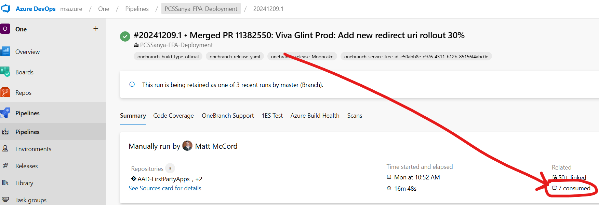
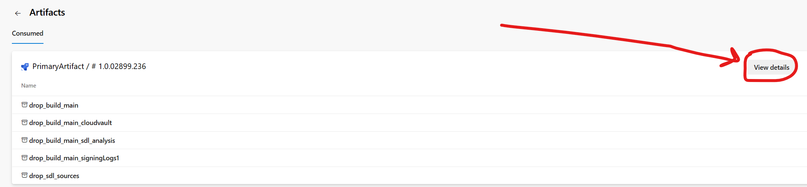
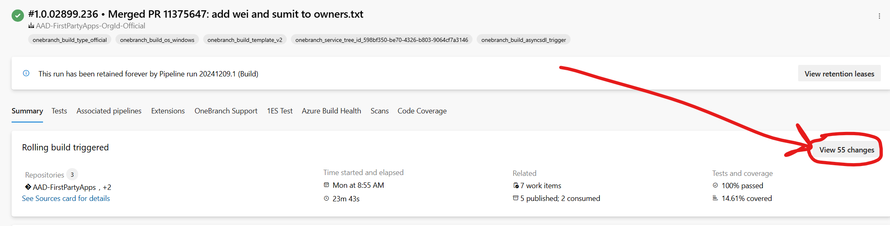

# Sanya RPS Certificate Renewal
### Dev steps for First Party Repo configuration updates.

#### Prerequisites
1. Yubikey and corp machine to make a commit to the repo w/ PME account that is a member of AP-PXService Security Group.
1. Have obtained a copy of the new AME issuer certificate from SRE, and saved it locally.
1. Have cloned down First Party Apps repo and setup the tooling. See [Getting Started](https://eng.ms/docs/microsoft-security/identity/entra-developer-application-platform/app-vertical/aad-first-party-apps/identity-platform-and-access-management/microsoft-identity-platform/apps-repo/repo-onboard-your-first-party-app) for the steps.  

  ---  
    
>[!NOTE]  
>No changes will be made in production with these commands, they work against the local repository.  
>No changes will be made in production until you do a final deployment via the release pipeline [PCSSanya-FPA-Deployment](https://msazure.visualstudio.com/One/_build?definitionId=397134&_a=summary).  
MAKE SURE YOU ARE NOT USING THE COMMAND `Set-ApplicationProperty`. ONLY USE `Set-OrgIdSiteProperty`.
  
  ---  

### Steps
#### 1. Local Changes
1. Open Powershell 7 in Admin mode.
1. Navigate to the first-party apps repo on your machine.
1. Checkout master and `git pull origin master`.
1. From repository root, run `.\Setup.ps1` (Need to run this every time you use the repo to ensure latest tooling / etc.)
1. Checkout a new branch: `git checkout -b paymentCollectionServiceSanya-update-keyCredentials-<todays date here>`
1. Run this command to add the new cert to the list of key credentials:  
`Set-OrgIdSiteProperty -SiteId 500014 -Env "Mooncake" -Property "keyCredentials" -ChangeType add -NewValue "C:\PATH\TO\AME\ISSUED\CERT.cer"`
1. Verify the new cert has been added under the `keyCredentials` property in the file `Customers\Configs\OrgIdSites\500014\OrgId.Mooncake.json`, and copy the value of the `keyId` property. 
1. Run this command to point to the new cert as the one to use for all encryption / RPS:
`Set-OrgIdSiteProperty -SiteId 500014 -Env "Mooncake" -Property "tokenEncryptionKeyId" -ChangeType "Update" -NewValue "<keyId copied from previous step>"`
1. Verify that the `tokenEncryptionKeyId` property has been updated to the new `keyId` value in the file `Customers\Configs\OrgIdSites\500014\OrgId.Mooncake.json`.
1. `git status` to confirm changes, then `git add` the changed files.
1. `git commit -m "<your message>` to commit them when ready. Select "N" when it asks to run the validations locally (Currently can be buggy and fail), they will also be run against the PR. You will need to verify PME identity with yubikey (can use your non-saw corp machine)
1. Push your changes: `git push origin paymentCollectionServiceSanya-update-keyCredentials-<todays date here>`

#### 2. Make a Pull Request
1. Navigate to [First-Party Apps Repo](https://msazure.visualstudio.com/One/_git/AAD-FirstPartyApps). Create a new Pull Request from your pushed up branch.
1. Navigate to the new PR. [Repo > Pull Requests](https://msazure.visualstudio.com/One/_git/AAD-FirstPartyApps/pullrequests?_a=mine)
1. Create a work item in the One project to link to the PR. You can create and use a copy of [[Payments Collection Service] Update certificate info for busbuy.cn Sanya / Mooncake](https://msazure.visualstudio.com/One/_workitems/edit/30172168/)
1. Create a work item in your project to link to the PR by adding this in the PR Description: `WILink: <url to work item in your team's project`. You can create and use copy of [PCS Sanya - pull request to update busbuy.cn cert](https://microsoft.visualstudio.com/OSGS/_workitems/edit/54922818)
1. The reviewers will be populated from owners.txt, have mccordmatt, kowshikp, or someone from the list review the PR.
1. Once all checks have passed, provide Proof of presence with a PME account (most likely will need to use SAW), then merge the PR.

#### 3. Deployment (**ONLY RUN DEPLOYMENT PIPELINE AFTER SRE HAS CONFIRMED COMPLETING THE UPDATING OF THE BUX1 MACHINE WITH THE NEW CERTS!**)
1. Navigate to the First-Party Apps Repo build pipeline [AAD-FirstPartyApps-OrgId-Official](https://msazure.visualstudio.com/One/_build?definitionId=378077&_a=summary), it will automatically trigger a build after your PR merges (may take a minute or so to trigger).
1. Once you verify the build is completed, navigate to our release pipeline [PCSSanya-FPA-Deployment](https://msazure.visualstudio.com/One/_build?definitionId=397134&_a=summary)
1. Click "Run Pipeline" button top-right. In the pop-up click "Run" bottom-right to run with the latest master build. Don't worry if another build was triggered after yours, this release pipeline specifically points to our orgId site folder within the repo at `Customers\Configs\OrgIdSites\500014\` so our changes will still be there.
1. Verify the running deployment has your changes by following these screenshots to navigate to the changes of the build being deployed:

1. On the next screen click on the top commit, then on the following screen click "Browse Files" button top-right.
1. Navigate to our OrgId site folder `Customers\Configs\OrgIdSites\500014\` and verify your changes are there in `OrgId.Mooncake.json` for `keyCredentials` addition, and `tokenEncryptionKeyId` update.
1. Navigate back to the currently running deployment to get the Approval Service link. A member of AP-PXService will need to use this link to approve the release.
1. Once approved, let SRE know the deployment is running and will usually complete in about 15 minutes.
1. Wait for deployment to complete, then let SRE know the new certificate is now set in First Party Portal for encryption.

#### References
1. [Making Changes to OrgId Site configurations](https://eng.ms/docs/microsoft-security/identity/entra-developer-application-platform/app-vertical/aad-first-party-apps/identity-platform-and-access-management/microsoft-identity-platform/apps-repo/reference-orgid-site-changes)
2. [Deploy a migrated app in the first-party apps repo](https://eng.ms/docs/microsoft-security/identity/entra-developer-application-platform/app-vertical/aad-first-party-apps/identity-platform-and-access-management/microsoft-identity-platform/apps-repo/manage-migrated-app-deploy)

---
For questions/clarifications, email [author/s of this doc and PX support](mailto:mccordmatt@microsoft.com?cc=PXSupport@microsoft.com&subject=Docs%20-%pcs/engineering/sanya-rps-certificate.md).
<!--
- Replace "mccordmatt" with the document owner's alias
- Replace "development/doc-template.md" with the actual file name
-->

---