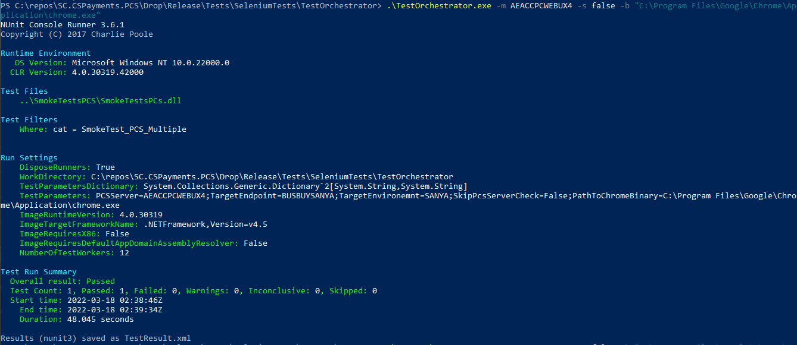
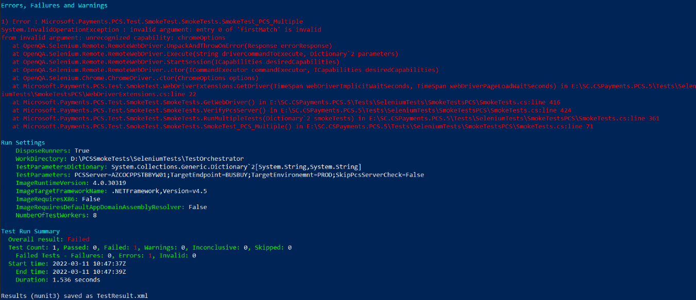
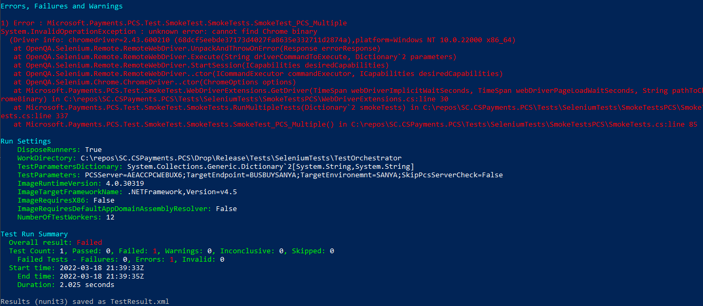
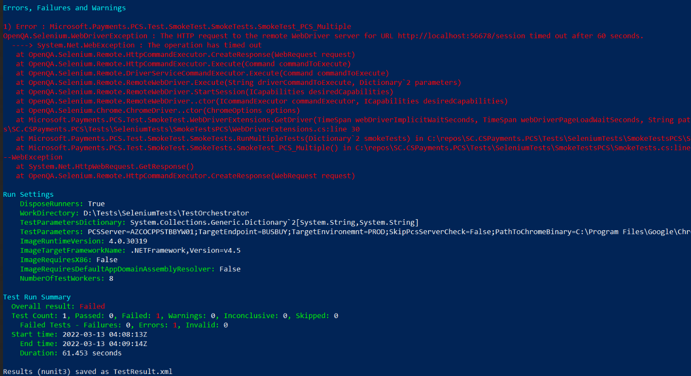

# Smoke Tests

## Running the smoke tests:
1. Open one instance of powershell
1. Open a second instance of powershell as Administrator
1. In the Administrator instance, before each smoketest run, you will want to run `taskkill /im "chromedriver.exe" /f` to clear any instances of the chrome driver still up from previous tests.
1. Then, in the first instance of powershell (_non_ admin) we will navigate to the TestOrchestrator folder:
    - `$ cd <path to Tests folder>\Tests\SeleniumTests\TestOrchestrator`
    - `$ .\TestOrchestrator.exe -m <machine name> -s <skip verify machine name?> -b <path to chrome.exe>`
        - `-m` example: `-m AZINTPCSBBYW01`
        - `-s` example: `-s true` or `-s false`
        - `-b` example: `-b "C:\Program Files\Google\Chrome\Application\chrome.exe"`
1. Assuming all goes well, you should see a success screen similar to this:

## Known issues:

### Invalid Argument / Unrecognized capability: chromeOptions
- Your version of Selenium is out of date. Please contact [mccordmatt@microsoft.com](mailto:mccordmatt@microsoft.com) on how to get the latest bits.  

### Cannot find Chrome binary
- The smoke test cannot automatically locate your `chrome.exe` location. Please pass it in with the `-b` flag (see example above).  

### The operation has timed out
- The smoke test was not able to find a certain element it was looking for. Possible reasons:
    - Certain Machines (CO1 and Sanya) require the machine running the smoke test to be on Corpnet.
        - You will potentially be able to tell this is the case if the smoke test can't even connect to the site. 
    - Something changed in PCS ui (Not very likely)  

---

For questions/clarifications, email [author/s of this doc and PX support](mailto:mccordmatt@microsoft.com?cc=PXSupport@microsoft.com&subject=Docs/pcs/operations/smoketests.md).

---