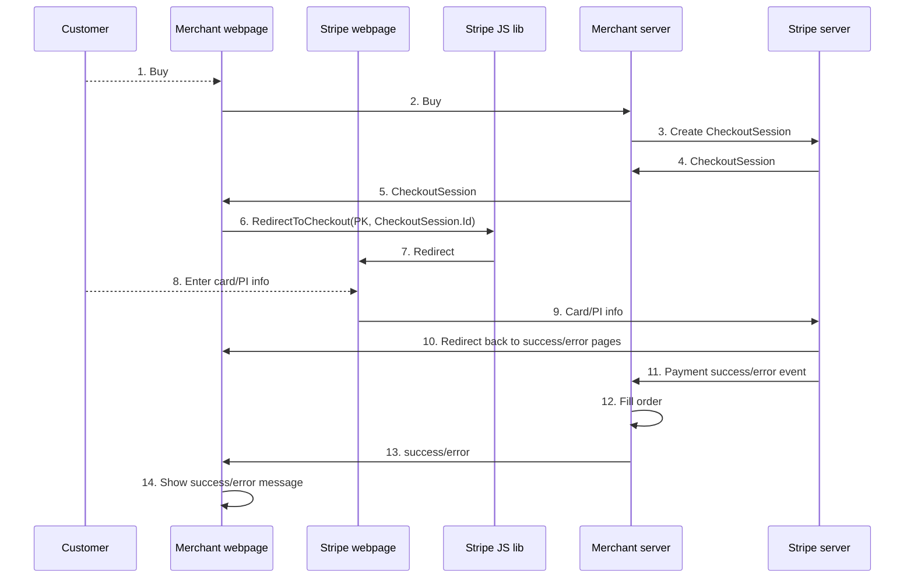

# Stripe Integration

#### Target Audience:
PX Engineering team

#### Overview
Describes Stripe APIs and how Merchants integrate with them to process payments.

#### Immediate Settle
The sequence diagram below shows interactions between a customer, the merchant and Stripe.  At design-time, the merchant creates an account with Stripe   

##### Screenshot
