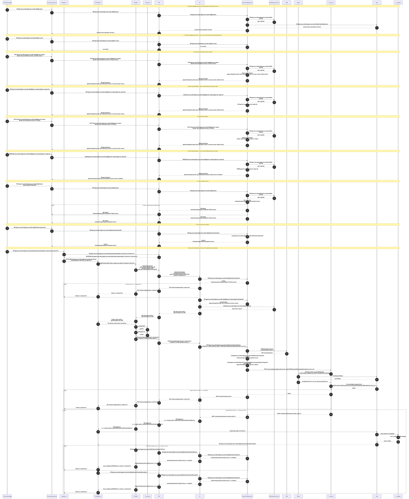
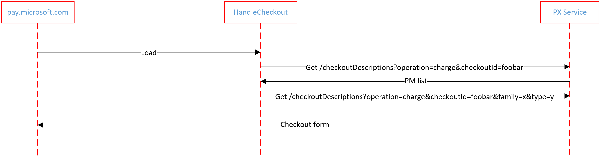

# Third party payment in Teams (3pp)

## Target audience
PX Engineering team

## Overview
The purpose of this doc is to provide context for devs to contribute to 3pp scenario

## Scenario
[Teams SMB Scenario](https://microsoft.sharepoint.com/:p:/t/USTPayments-3rdPartyPayments/EaAlUpM_0V1Lmp3jo1awwEABkEqJaju--two3krjKzrLAA?e=vpsokJ&isSPOFile=1&sourceId=&params=%7B%22AppName%22%3A%22Teams-Desktop%22%2C%22AppVersion%22%3A%2227%2F22010300411%22%7D)

## 3pp sequence diagram

## Supported test headers 
|Scenario                           |Test header and pay int link| 
|-----------------------------------|--------------------------------------------------------------------------------------------------------------|
|in meeting purchase                |[px.3pp.stripe.guestcheckout.success,px.sellermarket.stripe.us](https://payint.microsoft.com/payment-providers/stripe/checkout/123/start?redirectUrl=teams.microsoft.com&testScenarios=px.3pp.stripe.guestcheckout.success,px.sellermarket.stripe.us&platformType=msteams)|
|prepaid meeting purchase           |[px.3pp.stripe.guestcheckout.prepaid.success,px.sellermarket.stripe.us,px.pims.3pp.stripe.guestcheckout.success](https://payint.microsoft.com/payment-providers/stripe/checkout/123/start?redirectUrl=teams.microsoft.com&testScenarios=px.3pp.stripe.guestcheckout.prepaid.success,px.sellermarket.stripe.us,px.pims.3pp.stripe.guestcheckout.success&platformType=msteams)|
|terminal error - processor declined|[px.3pp.stripe.guestcheckout.processor.declined,px.sellermarket.stripe.us](https://payint.microsoft.com/payment-providers/stripe/checkout/123/start?redirectUrl=teams.microsoft.com&testScenarios=px.3pp.stripe.guestcheckout.processor.declined,px.sellermarket.stripe.us&platformType=msteams)|

## Sequence diagram to load checkout form from PM selection form
