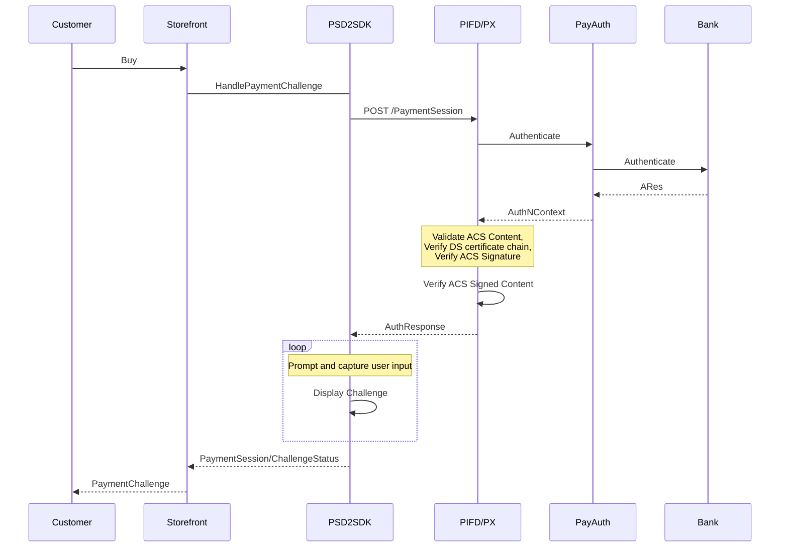

## PSD2 Scenario

## PSD2 Authenticate Scenario

---
For questions/clarifications, email [author/s of this doc and PX support](mailto:ADmello@microsoft.com;KowshikP@microsoft.com?cc=PXSupport@microsoft.com&subject=Docs/scenarios/listD365PendingOrders.md).

---