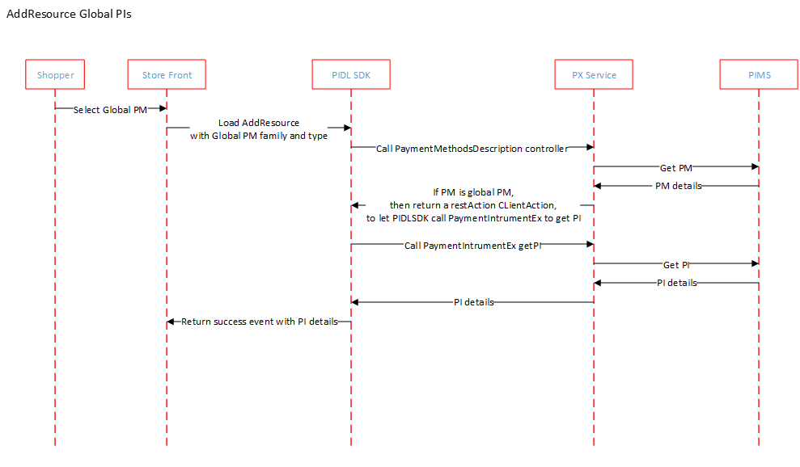

# AddResource for Global PI

## Summary
Global PI is a type of PI which user could use it without adding the PI, such as paysafecard and SOFORT.
To improve the usability of global PIs, one requirement is to group Global PIs under a meaningful group name and show them as payment methods in SelectResourceType component.
Once the user selects a global PI from payment method list, storefronts will load this global PI in AddResource component and expect us to return PI details from AddResource.
As Add PI is not needed for global PIs, PX /paymentMethodDescriptionsController will return the restAction to GET the PI. The diagram below describes the high level design for this flow.

## Flow diagram for AddResource for Global PI

---
For questions/clarifications, email [author/s of this doc and PX support](mailto:WWei@microsoft.com?cc=PXSupport@microsoft.com&subject=Docs%20-%20scenarios/amc-address.md).

---