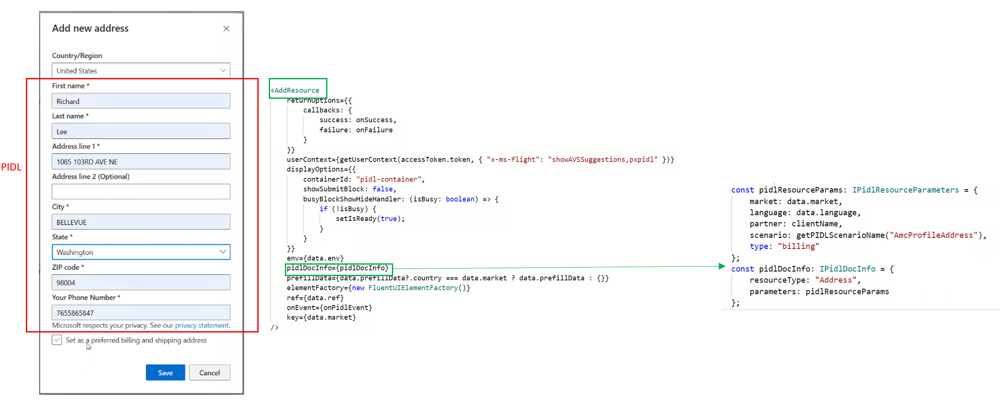
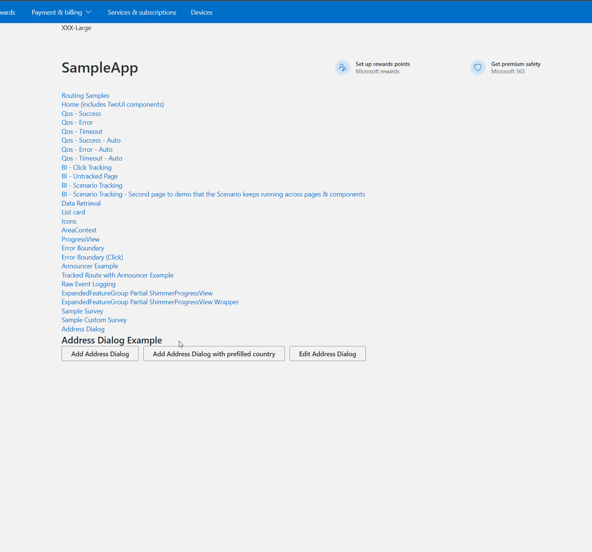
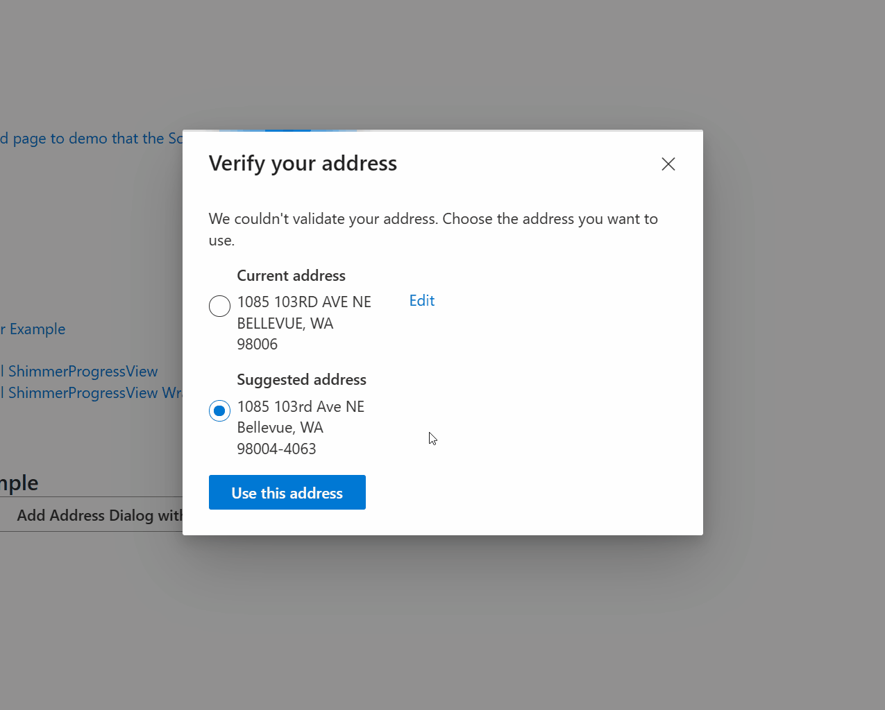

# AMC Address Component

## Summary
Overall requirement and functionality of this address form can be found in this Deliverable:
[Deliverable 29705678](https://microsoft.visualstudio.com/OSGS/_workitems/edit/29705678/): AMC React Migration - Support Add/Edit Address

- This address component is a react component that will be rendered with appropriate fields for different countries. 
- It provides client-side validation with predefined regex rules for user entered address information.
- It provides server-side validation and shows suggested address if user entered address doesn't pass server-side validation. (Right now only enabled for US)
- Country field is provided by AMC team so Country field is removed from this address component.
- A sample URL to get PIDL for this address form:
   - https://paymentinstruments.mp.microsoft.com/v6.0/users/me/AddressDescriptions?type=billing&scenario=profileAddress&partner=amcweb&operation=Add&country=US&language=en-US 
- Try this component in PIDLSDK react test portal (need a new MSA token in "Authorization Token" field to try): 
[Link of PIDLSDK test portal with desired parameters for AMC address form](https://pidlsdktestportal.azurewebsites.net/PidlReact.html?init=%7B%22addressType%22%3A%22billing%22%2C%22additionalHeaders%22%3A%22%7B%5C%22x-ms-flight%5C%22%3A%20%5C%22showAVSSuggestions%2Cpxpidl%5C%22%7D%22%2C%22elementFactoryName%22%3A%22fluentUi%22%2C%22environment%22%3A%22prod%22%2C%22partner%22%3A%22amcweb%22%2C%22resourceType%22%3A%22Address%22%2C%22scenario%22%3A%22profileAddress%22%2C%22windowSize%22%3A%22amcDialog%22%7D) 

## How to integrate this component
- Diagram to show the integration in high level

- A sample PR from AMC team to integrate with this component
   - [Pull Request 6465424](https://microsoft.visualstudio.com/Universal%20Store/_git/XS.AMC.UX/pullrequest/6465424): [Commerce flows] Address component

## How this address component is configured in PX
- This address component is created with the following PRs
   - [Pull Request 6333905](https://microsoft.visualstudio.com/Universal%20Store/_git/SC.CSPayments.PX/pullrequest/6333905): [AMC address] ProfileAddress for AMC
   - [Pull Request 6352208](https://microsoft.visualstudio.com/Universal%20Store/_git/SC.CSPayments.PX/pullrequest/6352208): [AMC address] Display change based on new UX design

## Demos

### Demo for using this address form from AMC test portal

### Demo for showing Address suggestion if address doesn't pass modern validation

---
For questions/clarifications, email [author/s of this doc and PX support](mailto:WWei@microsoft.com?cc=PXSupport@microsoft.com&subject=Docs%20-%20scenarios/amc-address.md).

---