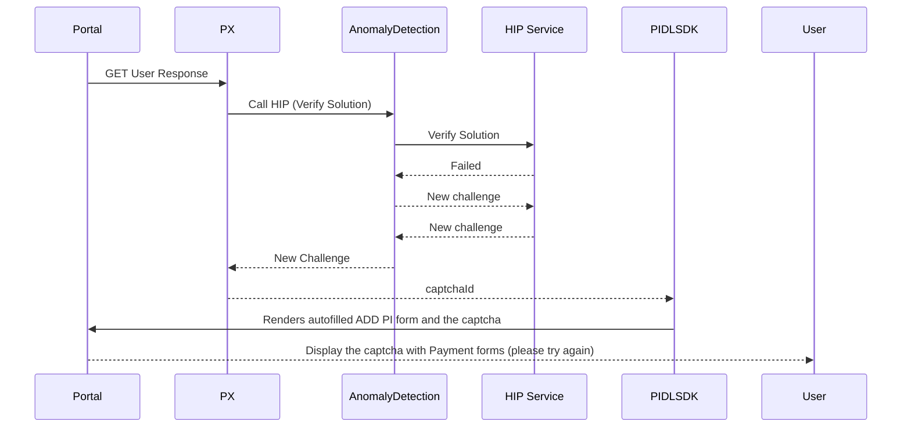
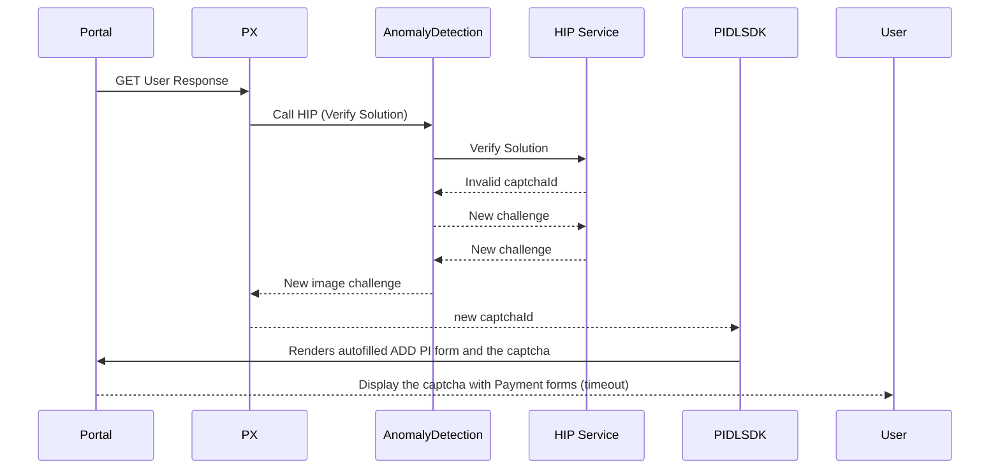
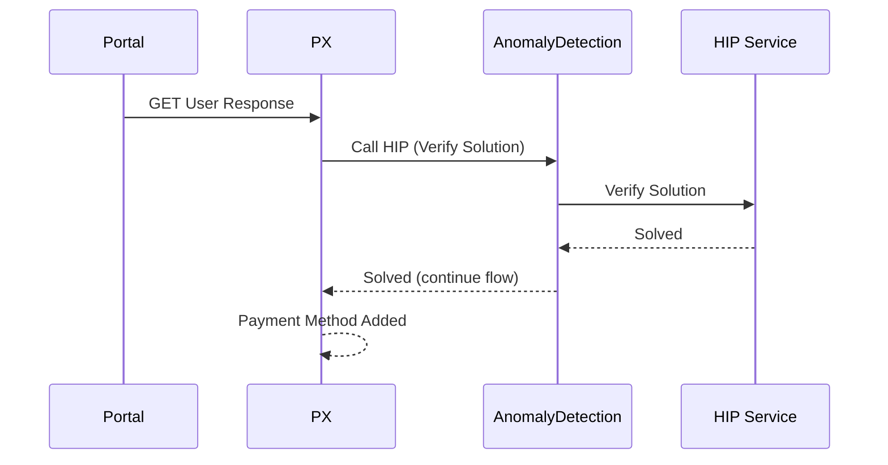

# Harding payments systems 

## HIP Captcha

## Overview

This doc contains description for the HIP captcha Challenge flow 

## Scenarios
All Scenarios are true as long as the user is identified as malicious 

## User fills out the payment form with CAPTCHA solution

### User Fails captcha verfication

### User does not complete the captcha in time

### User completes the captcha and clicks submit

 For more Documentation refer -  [here](https://microsoft.sharepoint.com/teams/PaymentExperience/_layouts/OneNote.aspx?id=%2Fteams%2FPaymentExperience%2FSiteAssets%2FPayment%20Experience&wd=target%28Projects%2FCaptcha.one%7C5502CE5B-9B53-414B-92C0-22F21A5A4048%2F%29
onenote:https://microsoft.sharepoint.com/teams/PaymentExperience/SiteAssets/Payment%20Experience/Projects/Captcha.one#section-id={5502CE5B-9B53-414B-92C0-22F21A5A4048}&end)