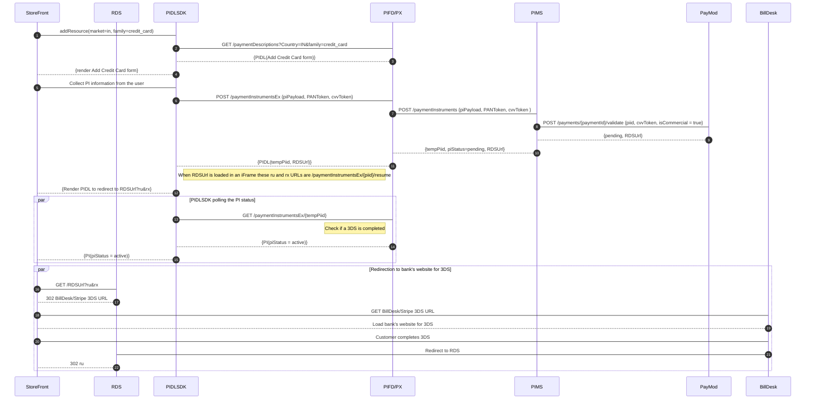

# India 3DS
This scenario is to enable  2FA / 3DS authentication in India market

Scenario [36777015](https://microsoft.visualstudio.com/OSGS/_workitems/edit/36777015): [Consumer] Comply with Indian eMandate and Card Storage Regulations for Consumer Txns

## Target audience
Developers and PMs contributing code or docs to PX

## Overview
This scenario is to handle the requirements that Reserve Bank of India has placed on merchants to transact in India market

## Prerequisites
- [PI - Add Credit Card](PI-add-credit-card.md)
- [Payment Challenge](payment-challenge.md)
- Partner has to provide their redirectional URL to PX service for the onboarding process.

## Summary
The Reserve Bank of India provides guidelines for transacting in India market.  Below are the two sets of guidelines that impact processing of transactions and card storage for India market.

### e-mandate Regulation:
The Reserve Bank  of India has implemented new regulations for merchants wishing to charge recurring transactions. Payments and Microsoft Storefronts will need to implement the following:
- 2FA at all customer present transactions
- e-mandate/consent collection at all subs purchase for new customers
- e-mandate/consent collection for existing subs customers
- Pre-debit notifications at least 24hrs prior to a renewal charge
- Consuming e-mandate/subs cancellation notification from the processor and cancelling the sub/no future renewal charges
- Enable RuPay and UPI PIs in India
- [Reserve Bank of India - Processing of e-mandate on cards for recurring transactions - Notification](https://www.rbi.org.in/Scripts/NotificationUser.aspx?Id=11668&Mode=0)
### Card Storage Regulation:
The RBI requires all merchants operating in India to comply with the following rules, effective June 30th, 2022:
- Onboard to a network or issuer PAN tokenization system for processing transactions
- Purge all PAN information from card vault
- Merchants are allowed to store specific transaction/PI info for the purposes of reconciliation - last 4 of PAN + card issuer name
- [Reserve Bank of India - Tokenisation - Card Transactions - Notification](https://www.rbi.org.in/Scripts/NotificationUser.aspx?Id=12159&Mode=0)

## Sequence Diagrams
### Add Credit Card
The below sequence diagram shows interactions for Add Credit Card

### Create Payment Session and Handle Payment Challenge
[India 3DS design for 2FA during One-time and Recurring e-mandate collection](https://microsoftapc.sharepoint.com/:u:/t/IndiaRecurringMandateRegulationPayments/Ebhli3pVxmBGs1HDTGajcQYBt0xpgNsuL9DCQo_WGDdKBw)

## Partner UX

|Partner            |Add PI 3DS UX  |Handle Payment Challenge 3DS UX    |UX Mocks   |
|----               |----           |----                               |----       |
|amcweb             |Inline         |Inline                             |[AMC](https://www.figma.com/file/g7JvdPQvf1ZmM9TbYIWHMZ/AMC-React-Migration?node-id=4287%3A43490)          |
|amcxbox            |QR Code        |Purchase is not supported in amcxbox partner                            |[AMC](https://www.figma.com/file/g7JvdPQvf1ZmM9TbYIWHMZ/AMC-React-Migration?node-id=4287%3A43490)          |
|cart               |Inline         |Inline                             |[MS Store](https://www.figma.com/file/6JlZTM5K5XuWZSrLRO5SK8/MS-Store--India-3DS?node-id=0%3A1)            |
|webblends          |Non-Inline     |Non-Inline                         |[MS Store](https://www.figma.com/file/6JlZTM5K5XuWZSrLRO5SK8/MS-Store--India-3DS?node-id=0%3A1)            |
|webblends_inline   |Inline         |Inline                             |[MS Store](https://www.figma.com/file/6JlZTM5K5XuWZSrLRO5SK8/MS-Store--India-3DS?node-id=0%3A1)            |
|xbox               |QR Code        |QR Code                            |[XBOX Console](https://www.figma.com/file/UkjEKwiZmbkvmD8hxtUuBO/PIDL_Console-Payments-(Master-%40-01b7826)?node-id=3%3A29439)           |
|northstarweb       |Inline         |Purchase is not supported in northstarweb partner      |[XBOX Console](https://www.figma.com/file/UkjEKwiZmbkvmD8hxtUuBO/PIDL_Console-Payments-(Master-%40-01b7826)?node-id=3%3A29439)           |
|officeOobe         |Iframe         |Iframe                             |           |
|payin              |Iframe         |Iframe                             |           |
|webPay             |Iframe         |Iframe                             |           |
|consumerSupport    |Iframe         |Iframe                             |           |
|xboxweb            |Iframe         |Iframe                             |           |
|setupofficesdx     |Iframe         |Iframe                             |           |
|setupoffice        |Iframe         |Iframe                             |           |

## Try the flow with x-ms-test header using ACS emulator

### Add Credit Card
To try the flow, send the scenarios in x-ms-test header.
In ACS emulator test scenario, enter code "456" to trigger success flow. Entry any other code (e.g. "111") three times to trigger failure flow.

|scenario                |Add PI 3DS UX      |scenarios                                                                                                                                                 |
|----                    |----               |----                                                                                                                                                      |
|Add PI - ACS emulator   |iFrame             |px-service-3ds1-show-iframe,px-service-psd2-e2e-emulator,BillDeskForceCreateToken,BillDeskUseTestEncryption,BillDeskTokenization,GenericPaymentsTestStore |
|Add PI - ACS emulator   |Inline/Non-Inline  |px-service-psd2-e2e-emulator,BillDeskForceCreateToken,BillDeskUseTestEncryption,BillDeskTokenization,GenericPaymentsTestStore                             |

### Create Payment Session and Handle Payment Challenge
To try the flow, send the scenarios in x-ms-test header
In ACS emulator test scenario, enter code "456" to trigger success flow. Entry any other code (e.g. "111") three times to trigger failure flow.

|scenario                                           |Handle Payment Challenge 3DS UX    |scenarios                                                                                  |
|----                                               |----                               |----                                                                                       |
|handlePaymentChallenge - challenge ACS emulator    |iFrame                             |px-service-billdesk-provider,px-service-psd2-e2e-emulator,px-service-3ds1-show-iframe      |
|handlePaymentChallenge - challenge ACS emulator    |Inline/Non-Inline                  |px-service-billdesk-provider,px-service-psd2-e2e-emulator                                  |

## Try the flow with x-ms-test header with mock response (In INT environment, add credit card India 3DS flow may only work with mock response but not with ACS emulator)
Please refer to "Test with Test Header" section in this [Wiki](https://teams.microsoft.com/l/channel/19%3Aae8ed901432c44aaae8b4046620e2b8a%40thread.skype/tab%3A%3Ae7a14d58-5833-4a4f-a5f7-6684c4dc79b0?groupId=882f553f-fd38-4ce1-90bd-7d5e0e8db317&tenantId=72f988bf-86f1-41af-91ab-2d7cd011db47&allowXTenantAccess=false).

---
For questions/clarifications, email [author/s of this doc and PX support](mailto:KowshikP@microsoft.com?cc=PXSupport@microsoft.com&subject=Docs/scenarios/india-3ds.md).

---