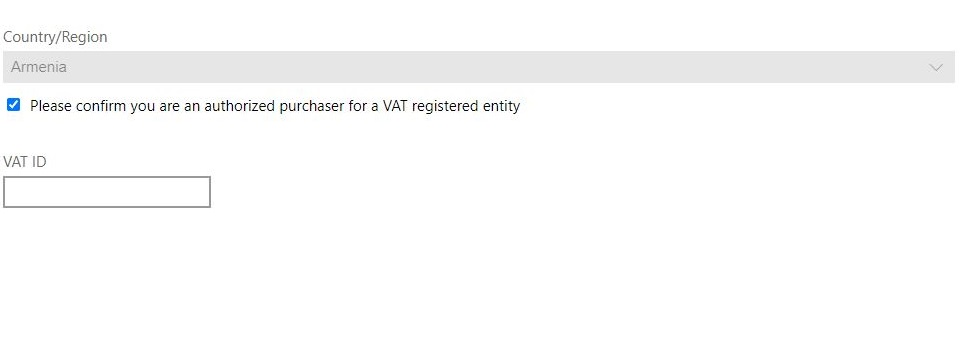
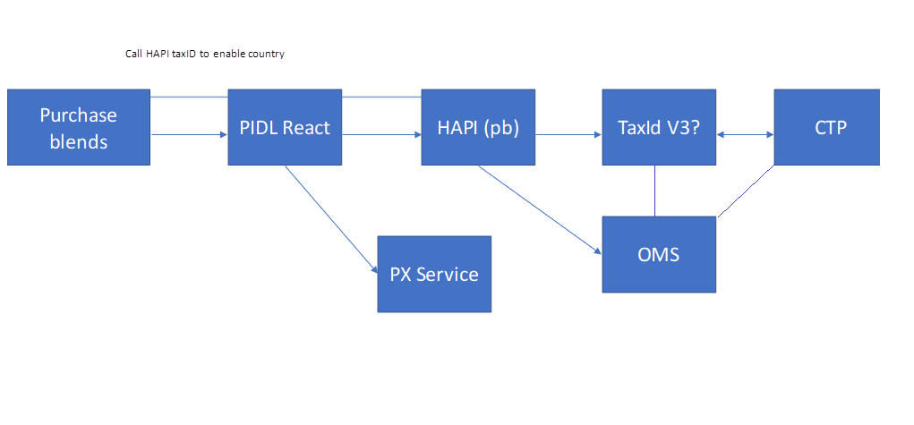

# Tax ID Collection
TThis project will enable Tax ID collection for all C+E portals and as a result tax calculation/determination for upcoming compliance regulations. This is a requirement for some countries to comply with the local tax laws. The goal is to enable the Tax IDs in a bunch to have them available when required and ensure compliance in a timely manner. Historically, each Tax ID collection takes a couple of months. By bundling this for multiple countries in a single ask, we are utilizing resources effectively to meet Tax requirements. 

## Target audience
Developers and PMs contributing code or docs to PX

# Target code and integration completion date
March 31, 2022

# Scenario link
Deliverable [37819531](https://microsoft.visualstudio.com/OSGS/_workitems/edit/37819531): [Nickel +] Tax ID collection for 26 countries: PIDL

# Contacts
Dev: Jie Fan
PM: John Ndunguru

## Summary
[One pager description](https://microsoft-my.sharepoint.com/:w:/p/kagoel/Ecu6IgWeEFVOgKrRIkcSCZ8BOk_GS6-FF9Nv-VIPvRaDTg?e=vRKn91&isSPOFile=1&CID=8C40E7CA-055E-47FD-80B5-8AA9C42730B2&wdLOR=cC0148737-BA53-4C38-8A26-86CEBC19DA8D)

## Partner to be supported
|Partner Name      |PIDL Resource Type|Resource Type|Resource Type| Resource Scenario|flights|Screenshot| Test Portal Url |Comments|                                                      
|------------------|------------------|-------------|-----------------------| --------------|-------------| ------------------|--------------|--------------|
|azure             |TaxID             | Update      |commercial_tax_id      | withCountryDropdown |NA      | |[Update taxId](https://pidlsdktestportal.azurewebsites.net/?mode=online&version=latest)| Js portal is required. Only work in PX local                                     |
|commercialstores  |TaxID             | Add         |commercial_tax_id      | departmentalPurchase/withCountryDropdown|dpHideCountry| |[Add TaxId](https://pidlsdktestportal.azurewebsites.net/pidlreact.html?init=%7B%22additionalHeaders%22%3A%22%7B%5C%22x-ms-flight%5C%22%3A%5C%22dpHideCountry%5C%22%7D%22%2C%22elementFactoryName%22%3A%22fluentUi%22%2C%22environment%22%3A%22prod%22%2C%22market%22%3A%22fj%22%2C%22partner%22%3A%22commercialstores%22%2C%22resourceType%22%3A%22TaxId%22%2C%22scenario%22%3A%22departmentalPurchase%22%2C%22taxIdType%22%3A%22commercial_tax_id%22%2C%22windowSize%22%3A%22windowsStoreModal%22%7D)                                                               | Authorization Token needed be replaced by AuthGenUI generated WLID1.0 token    |
|commercialstores  |TaxID             | Update      |commercial_tax_id      | departmentalPurchase/withCountryDropdown|             |?? not able to loaded |not able call HAPI |                                                                                   |
|commercialstores  |Profile           | Update      |organization           | NA                                      |             |                          |[Update Profile](https://pidlsdktestportal.azurewebsites.net/pidlreact.html?init=%7B%22api%22%3A%22updateResource%22%2C%22elementFactoryName%22%3A%22fluentUi%22%2C%22market%22%3A%22am%22%2C%22partner%22%3A%22commercialstores%22%2C%22profileType%22%3A%22organization%22%2C%22resourceType%22%3A%22Profile%22%7D)                                                         | Only work in PX Local with mock commercieapi taxids and profiles call in fiddler  |
|commercialstores  |Address           | Update      |hapiServiceUsageAddress| NA                                      |             |                   |[Update Address](https://pidlsdktestportal.azurewebsites.net/pidlreact.html?init=%7B%22addressType%22%3A%22hapiServiceUsageAddress%22%2C%22api%22%3A%22addAddress%22%2C%22elementFactoryName%22%3A%22fluentUi%22%2C%22market%22%3A%22am%22%2C%22partner%22%3A%22commercialstores%22%2C%22scenario%22%3A%22serviceusageaddress%22%7D) | Only work in PX Local with mock commercieapi taxids and orders call in fiddler |

## Component Dependancy
 

## Sample PR for Thailand
[Collect VAT ID for Thailand](https://microsoft.visualstudio.com/Universal%20Store/_git/SC.CSPayments.PX/commit/872ff2662e012dd5f7157497aeca8c8c2fc8b839)
