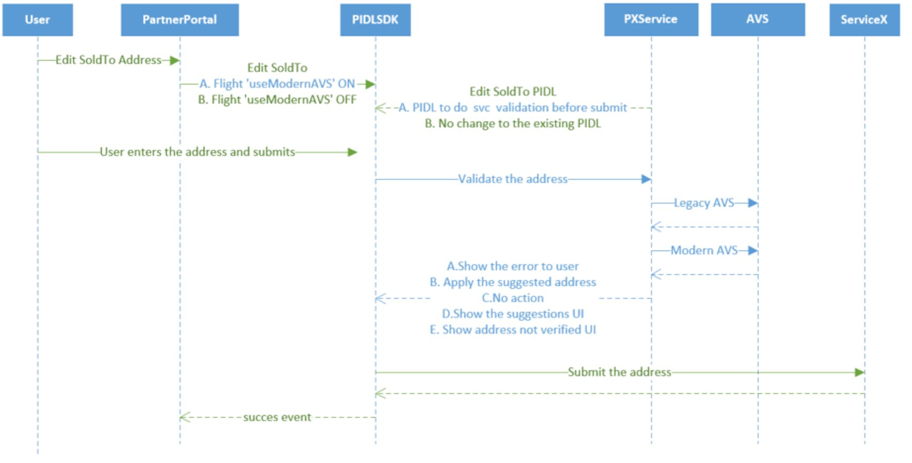
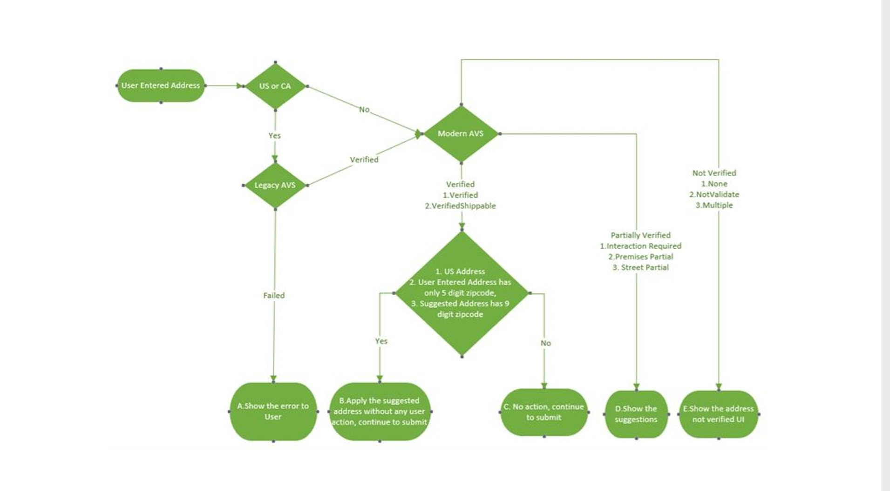
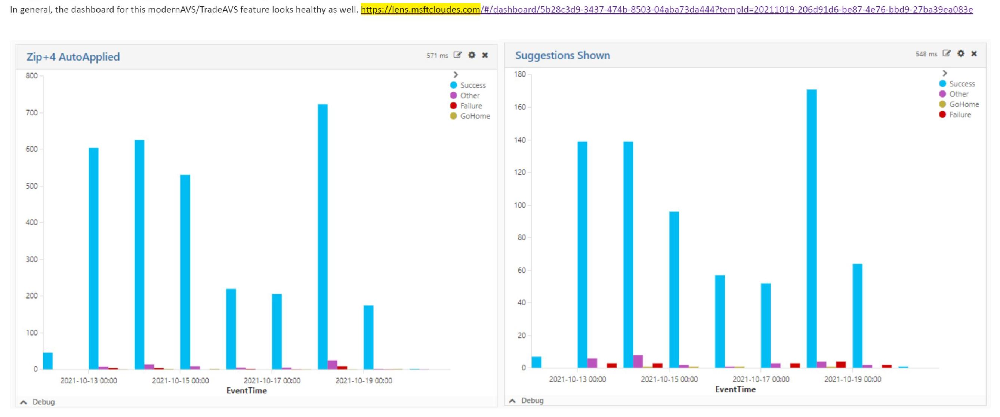
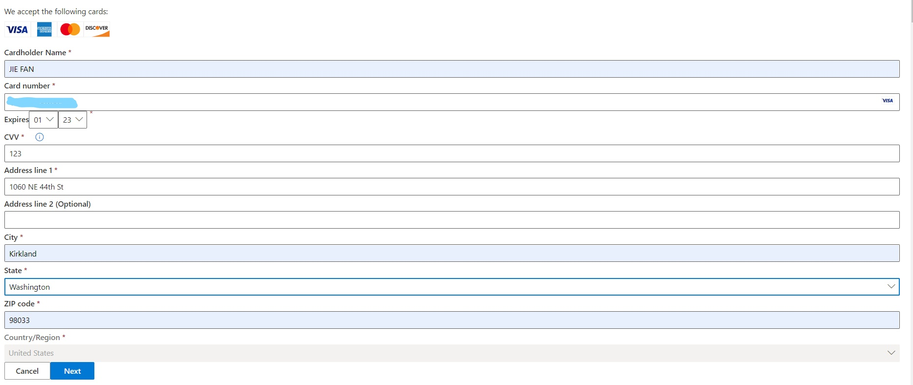
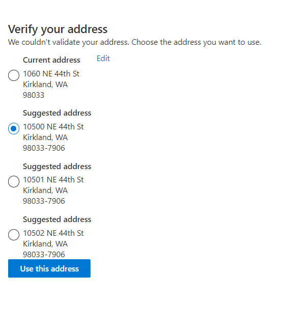
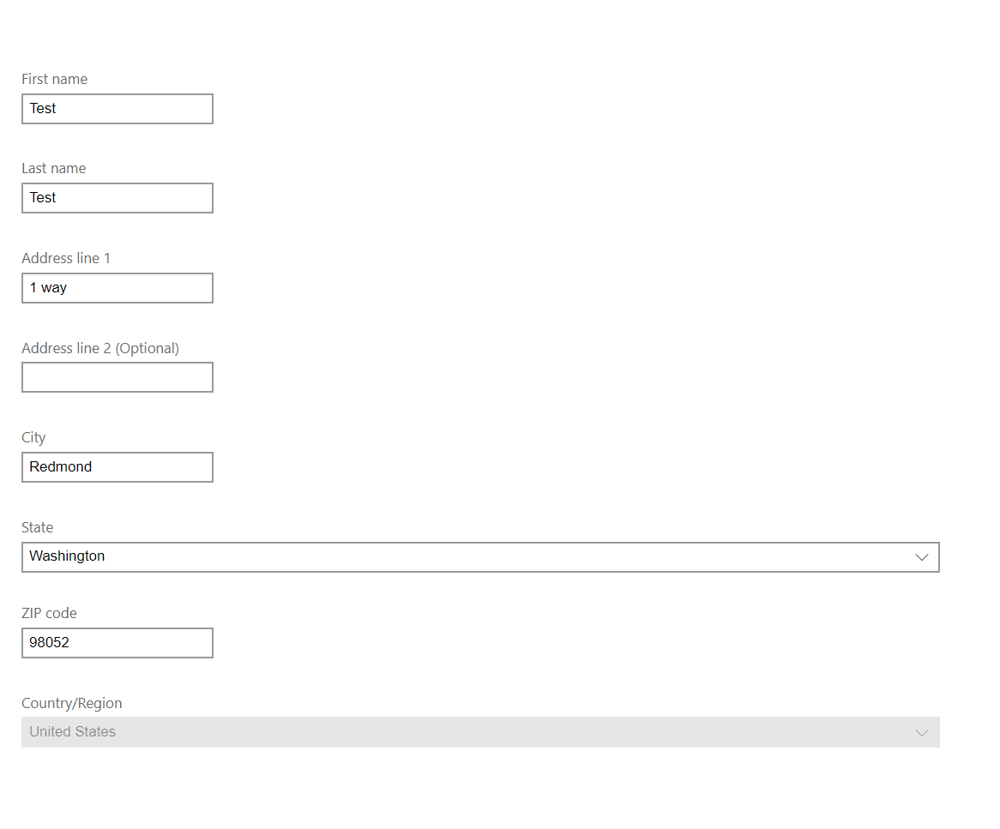

# Trade AVS

## Target audience
PX Engineering team

## Overview
The purpose of this doc is to provide context for dev/oncall to monitor Trade AVS traffic through holiday. More details of Trade AVS will be documented in the future.

## Prerequisites
N/A

## What is Trade AVS
Collecting highest quality address to satisfy DOJ requirements and ensure accurate taxation
- For Cobalt: 25 High Risk Countries + US
- For Ni+: expand to more countries (rough estimation)

## How Trade AVS works
- Sequence diagram

- Flow chart (out of date on US/CA check)

## How to Monitor Trade AVS
Below is the the dashboard to monitor the health of Trade AVS feature (data partially rewired, need complete it)
- [Trade AVS dashboard](https://lens.msftcloudes.com/#/dashboard/e3c4bf12-906a-4d5e-b1f3-effc305bab61?temp=0&isSample=false&_g=())

Below is an example of healthy dashboard of TradeAVS:

## Supported Partners
commercialstores and azure (includes azure sign up and azure ibiza)

## Supported forms
- Azure signup team (use azure as partner name)

| Form name  | Address Type | React portal link| PX URL| AVS validation flag supported | 
| -------    | ------------ | ---------------- | ----- | ----------------------------- |
| Add PI     | billing      | [link](https://pidlsdktestportal.azurewebsites.net/PidlReact.html?init=%7B%22additionalHeaders%22%3A%22%7B%5C%22x-ms-flight%5C%22%3A%5C%22showAVSSuggestions%5C%22%7D%22%2C%22elementFactoryName%22%3A%22officeFabric%22%2C%22partner%22%3A%22azure%22%2C%22paymentMethodFamily%22%3A%22credit_card%22%2C%22paymentMethodType%22%3A%22amex%2Cvisa%2Cmc%2Cdiscover%2Cjcb%22%7D) | https://paymentinstruments.mp.microsoft.com/v6.0/users/me/paymentMethodDescriptions?type=visa%2Cmc%2Camex%2Cdiscover%2Cjcb&partner=Azure&operation=Add&language=en-US&family=credit_card&country=US&completeprerequisites=true) | ?? |
| Add Address| billing      | NA               | https://paymentinstruments.mp.microsoft.com/v6.0/AddressDescriptions?type=billing&partner=Azure&operation=Add&language=en&country=US |           |

- Azure ibiza team (use azure as partner name, scenario azureIbiza as scenario )

| Form name  | Address Type          | React portal link| PX URL| AVS validation flag supported | 
| -------    | --------------------- | ---------------- | ----- | ----------------------------- |
| Add Address| hapiv1SoldToIndividual| NA               |v6.0/addressDescriptions?type=hapiv1SoldToIndividual&partner=Azure&operation=Add&language=en-us&country=US |           |
| Add Address| hapiv1BillToIndividual| NA               |v6.0/addressDescriptions?type=hapiv1BillToIndividual&partner=Azure&operation=Add&language=en-us&country=US |           |
| Add Address| hapiv1SoldToOrganization| NA             |v6.0/addressDescriptions?type=hapiv1SoldToOrganization&partner=Azure&operation=Add&language=en-us&country=US |           |
| Add Address| hapiv1BilltoOrganization| NA             |/v6.0/addressDescriptions?type=hapiv1BilltoOrganization&partner=Azure&operation=Add&language=en-us&country=US |           |
| Add PI     | billing      | [link](https://pidlsdktestportal.azurewebsites.net/PidlReact.html?init=%7B%22additionalHeaders%22%3A%22%7B%5C%22x-ms-flight%5C%22%3A%5C%22showAVSSuggestions%5C%22%7D%22%2C%22elementFactoryName%22%3A%22officeFabric%22%2C%22partner%22%3A%22azure%22%2C%22paymentMethodFamily%22%3A%22credit_card%22%2C%22paymentMethodType%22%3A%22amex%2Cvisa%2Cmc%2Cdiscover%2Cjcb%22%7D) | https://paymentinstruments.mp.microsoft.com/v6.0/users/me/paymentMethodDescriptions?type=visa%2Cmc%2Camex%2Cdiscover%2Cjcb&partner=Azure&operation=Add&language=en-US&family=credit_card&country=US&completeprerequisites=true) | ?? |

Note: partner azure is using js version of PIDLSDK instead of React. In the above form, we provide react portal link to make test easier.   

- Commercialstores team (user commercialstores as partner - purchase flow)

| Form name         | Profile Type | Address Type            | Portal in Mac | PI Family & Type      | React portal link| PIFD URL                                                                                                                                                                                                                            |
| ----------------- |------------- |-------------------------| ------------- |-----------------------|------------------| ------------------------------------------------------------------------------------------------------------------------------------------------------------------------------------------------------------------------------------|
| Add Address       | Organization​​ | hapiv1SoldToIndividual  | Purchase Flow |NA                     | NA               |https://paymentinstruments.mp.microsoft.com/v6.0/users/my-org/ProfileDescriptions?type=organization&partner=commercialstores&operation=Add&country=US&language=en-US​​                                                                 | 
| Update Address ?? | Organization​​ | hapiV1SoldToOrganization​| Purchase Flow |Purchase Flow          | NA               |https://paymentinstruments.mp.microsoft.com/v6.0/users/my-org/AddressDescriptions?type=hapiV1SoldToOrganization&partner=commercialstores&operation=Update&country=US&language=en-US​​​                                                  |
| Add PI            | Organization​​ | billToAddress??         | Purchase Flow |credit_card            | NA               |https://paymentinstruments.mp.microsoft.com/v6.0/users/me/paymentMethodDescriptions?type=visa%2Cmc%2Camex%2Cdiscover&partner=commercialstores&operation=Add&country=US&language=en-US&family=credit_card&completePrerequisites=true​​  |
| Add PI            | Organization​​ | billToAddress??         | Purchase Flow |virtual - invoice_check​| NA               |https://paymentinstruments.mp.microsoft.com/v6.0/users/my-org/paymentMethodDescriptions?type=invoice_check&partner=commercialstores&operation=Add&country=us&language=en-US&family=virtual​​                                           | 

- Commercialstores team (user commercialstores as partner - signup flow) sign up scenario??

| Form name         | Profile Type | Address Type            | Portal in Mac | PI Family & Type      | React portal link| PIFD URL| AVS validation flag supported | 
| ----------------- |------------- |---------------------    | ------------- |-----------------------|----------------  | -----   | ----------------------------- |
| Add PI            | Organization​​ | billToAddress??         | Sign up Flow  |credit_card            | NA               |https://paymentinstruments.mp.microsoft.com/v6.0/users/me/paymentMethodDescriptions?type=visa%2Cmc%2Camex%2Cdiscover&scenario=signup&partner=commercialstores&operation=Add&country=US&language=en&family=credit_card&completePrerequisites=true​​ ||
| Add PI            | Organization​​ | billToAddress??         | Sign up Flow  |NA                     | NA               |https://paymentinstruments.mp.microsoft.com/v6.0/users/me/paymentMethodDescriptions?family=credit_card&language=en-us&country=US&operation=Add&partner=commercialstores&type=mc%2Cvisa%2Camex%2Cdiscover%2Cjcb​​ ?? ||
| Update Profile    | Organization​​ | SoldToAddress??         | Sign up Flow  |NA                     | NA               |https://paymentinstruments.mp.microsoft.com/v6.0/users/me/paymentMethodDescriptions?type=visa%2Cmc%2Camex%2Cdiscover&scenario=signup&partner=commercialstores&operation=Add&country=US&language=en&family=credit_card&completePrerequisites=true​​ ||

- Subscription management 

| Form name         | Profile Type | Address Type            | Portal in Mac | PI Family & Type      | React portal link| PIFD URL| AVS validation flag supported | 
| ----------------- |------------- |---------------------    | ------------- |-----------------------|----------------  | -----   | ----------------------------- |
| Update Address    | Organization​​ |hapiServiceUsageAddress  | Sub management|NA                     | NA              |https://paymentinstruments.mp.microsoft.com/v6.0/users/my-org/AddressDescriptions?type=hapiServiceUsageAddress&partner=commercialstores&operation=Update&country=US&language=en-US​​ ||
| Add PI not inscope| Organization​​ | ？？                    | Sub management|NA                     | NA              |https://paymentinstruments.mp.microsoft.com/v6.0/users/me/paymentMethodDescriptions?type=visa&scenario=includecvv&partner=commercialstores&operation=Update&language=en-US&family=credit_card&country=US​​ |not in scope??|

- more commercialstores scenarios can be found to be summarized [here](https://microsoft-my.sharepoint.com/personal/jiefan_microsoft_com/_layouts/OneNote.aspx?id=%2Fpersonal%2Fjiefan_microsoft_com%2FDocuments%2FJie%20%40%20Microsoft&wd=target%28Address.one%7C48A1606F-E420-4301-8DB2-D9DFB45D75B2%2FTradeAVS%20-%20Form%7CDFD9AEBA-817F-42A1-A13B-192B20982BE1%2F%29)
​​

## Add PI with address verification 
Add Credit Card Information

Address suggestion page shows

## Add Address
Azure signup Add Address

- how to test it in portal

## Reference
- [P+S All Hands Trade AVS Slide 58 - 61](https://microsoft-my.sharepoint.com/:p:/p/wiwhite/ESbUCqdKLZZJpLZ3gVmMjX8BOkM3D0zLlfioGHJI7OZUzw?e=SPuJkk&nav=eyJzSWQiOjIxMjMyNTg4MTYsImNJZCI6MjIxNjc1MzI5MH0)
---
For questions/clarifications, email [author/s of this doc and PX support](mailto:wwei@microsoft.com?cc=PXSupport@microsoft.com&subject=Docs%20-%20development/trade-avs.md).

---