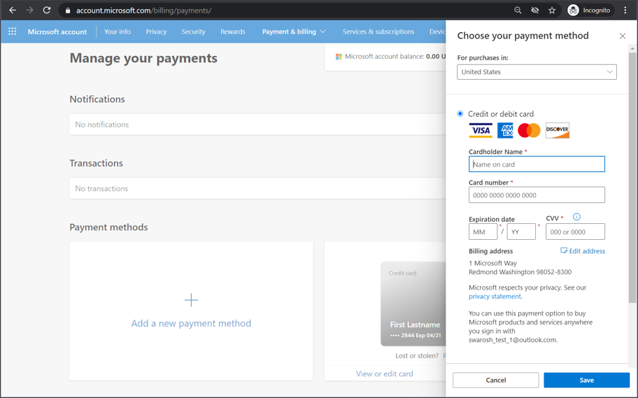
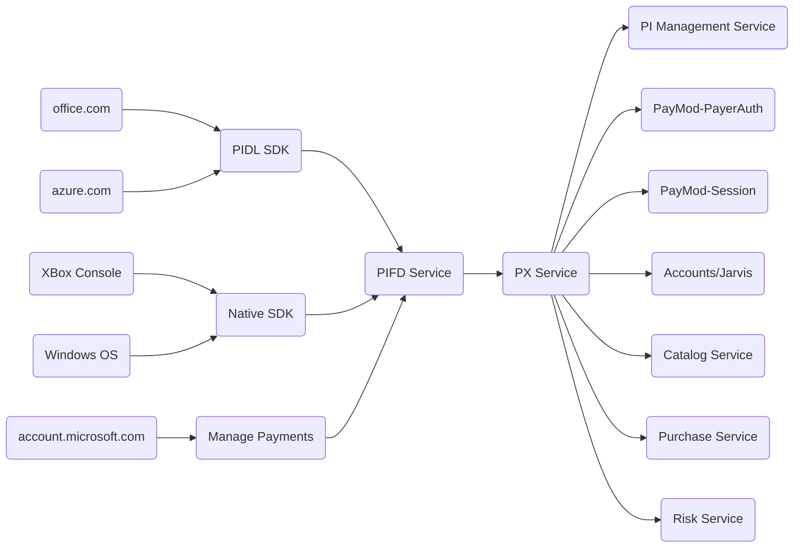
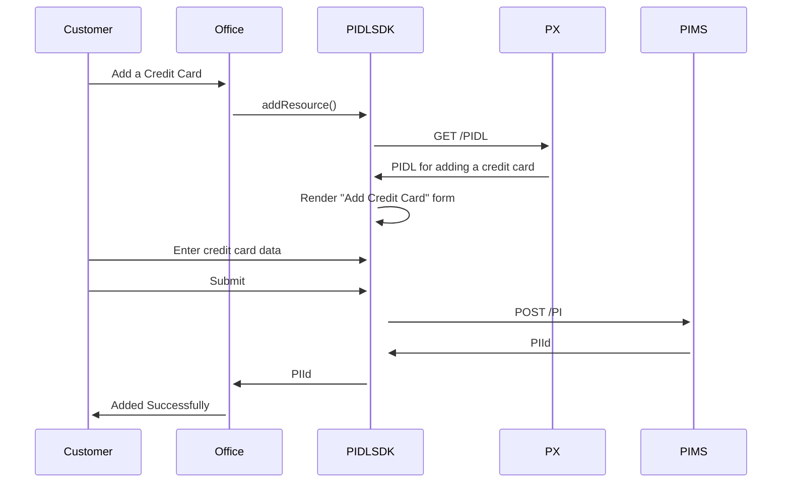
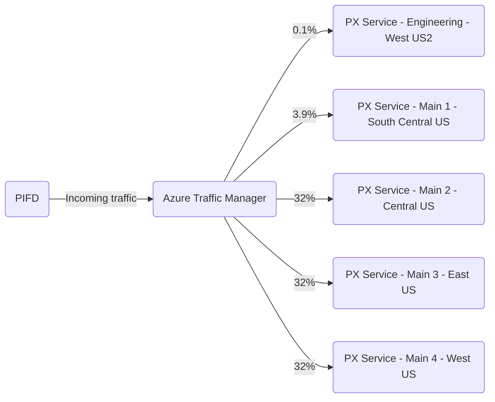

# PX System

## Target audience
Developers and PMs contributing code or docs to PX

## Overview
This doc describes a high level architecture of the PX System. PX system includes PX Service and PX Client
 components: PIDL SDK, Native SDK, and Manage Payments.

## Usage
A user adding a credit card on [Microsoft Accounts](https://account.microsoft.com/payments) portal (image below)
 is en example of a Payment Experience. PX Clients and PX Service enable Payment Experiences on online stores
 across various Microsoft businesses.

## Components
PIDL SDK, Native SDK, and Manage Payment components are referred to as "PX Clients". PX Service is a REST service
 that PX Clients depend on.

### PX Service
PX Service returns metadata that describes Payment Experiences at runtime. A customer adding a credit card on
 signup.azure.com is an example of a Payment Experience. This metadata is called a PIDL document or PIDL in short
 and are json objects returned from a REST endpoints of PX service.

### PX Clients
PX Clients (PIDL SDK, Native SDK, and Manage Payment) don't have design time knowledge of what a credit card
 form looks like. Instead, they depend on PIDL to describe it at runtime and render the UI accordingly. Also when
 users click "submit", PX Clients depend on PIDL to determine where the form data is posted and how errors are
 handled.

## Sequence
Diagram below shows typical sequence of interactions when a user tries to add a credit card. It leaves out many details on
 purpose in order to keep it simple and covey the following main points:

1.  PIMS stores and manages the PI resource
2.  PX Service describes the PI resource and UX
3.  Based on that description, PIDL SDK renders UX and posts user-entered data to PIMS

## Topology
Below diagram shows PX service deployment topology at a high level

---
For questions/clarifications, email [author/s of this doc and PX support](mailto:kowshikpfte@microsoft.com?cc=PXSupport@microsoft.com&subject=Docs%20-%20system/px-system.md).

---
