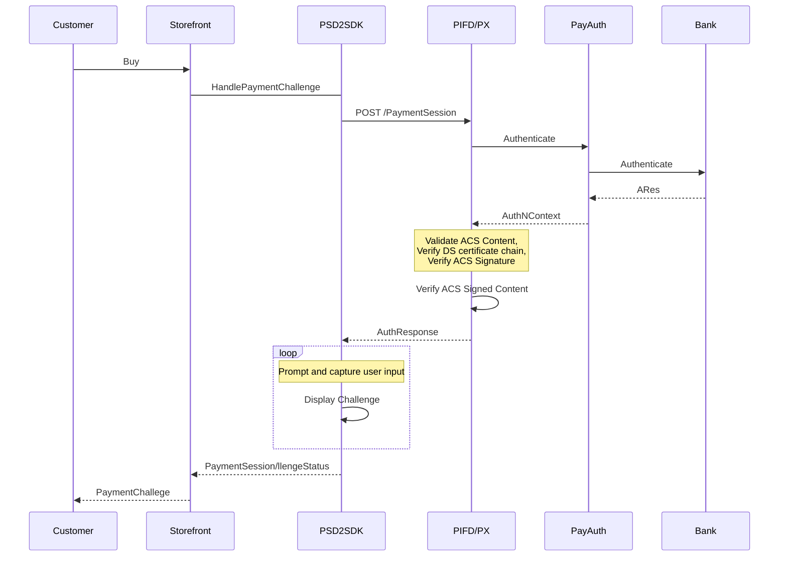

## Workflow

<h2 align="center">
PSD2 Authenticate Scenario
</h2>

```mermaid
sequenceDiagram
    participant Customer    
    participant Storefront
    participant PSD2SDK
    participant PIFD/PX
    participant PayAuth
    participant Bank

    Customer->>Storefront: Buy
    Storefront-> PSD2SDK: HandlePaymentChallenge
    PSD2SDK->>PIFD/PX: POST /PaymentSession
    PIFD/PX->>PayAuth: Authenticate
    PayAuth->>Bank: Authenticate
    Bank-->>PayAuth: ARes
    PayAuth-->>PIFD/PX: AuthNContext
    Note over PIFD/PX: Validate ACS Content, <br/> Verify DS certificate chain, <br/>Verify ACS Signature
    PIFD/PX->>PIFD/PX: Verify ACS Signed Content
    PIFD/PX-->>PSD2SDK:  AuthResponse
    loop 
        Note over PSD2SDK: Prompt and capture user input
        PSD2SDK->>PSD2SDK: Display Challenge
    end
    PSD2SDK-->>Storefront: PaymentSession/llengeStatus
    Storefront-->>Customer: PaymentChallege
```